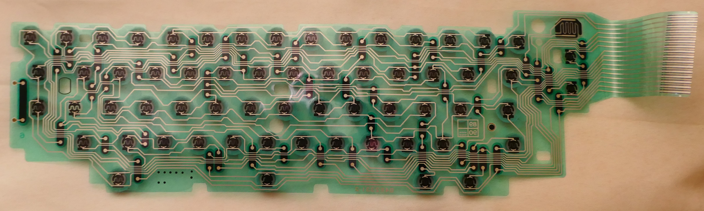

## Introduction

After completing the software and hardware for sending SMS messages to a Panasonic T36, I decided to attempt the same on a Brother AX-350. The Brother is slightly newer, 1991 vs 1986. It has many similar features to the T36 including bold, underline, centering, auto return (6 character hot zone vs 8 character hot zone) and right flush. It also includes pitch and line spacing control via the keyboard. On the T-36 these two features must be accomplished using external switches. The AX-350 does not include an LCD which makes the design much less complex and the controls more compact. I will likely be adding my own LCD anyway.

One of the biggest advantages is that all the Brother electric models accept commonly available daisy wheel print heads which means I can easily replace the wheel if it wears out and use a variety of fonts including, Script, Prestige Italic, Letter Gothic, etc. Also the wheels can be easily hot swapped during typing. The T36 uses a cup printing head design and replacements are almost impossible to find.  I am lucky I had a second T36 because the print cup in the original one I got from Goodwill was not only almost completely worn out, some of the teeth were missing.

In addition, printer ribbons for Brother electric typewriters are very easy to find at a reasonable price.  In fact, Brother USA still sells an [electric typewriter starter kit](https://www.brother-usa.com/products/sk100?srsltid=AfmBOorkX5mifmxxWNrz39cKU2FdmVSdJc7oQHnvRc7U7kxkS1z8FtNh) that includes 1-Script Daisy Wheel, 3 -1030 Ribbons & 1-3010 Lift-off Correction Tape for only $40. 

Another huge advantage of the AX-350 over the T36 is that the keyboard interface is single 16 pin header divided neatly into 8 inputs and 8 outputs. The T36 had two 12 pin headers which did not neatly correspond to inputs and outputs much less 12 inputs and 12 outputs. The AX-350 represents better engineering and makes interfacing to the typewriters circuit board much easier!

## First Step

I am now attempting to write blog posts on a weekly basis so that I can share them with my students who are required to present blog posts every Friday detailing their own work. Feel free to check them out [here](https://mvthsengineering.com/students/). Since I just started work on this new typewriter, I am intending to document the process in "real time."  

The first step in designing a control for any electric typewriter is decoding the keyboard and although the AX-350 has a more logical design, this is still challenging task. Below you can see a picture of the top of the flex circuit from inside the AX-350s keyboard. Each gray silicone circle corresponds to a key on the keyboard. When a key is pressed exactly two contacts one above and one below the circle are shorted.

Below is a picture of the bottom of the circuit. Here you see all the traces with the contacts above and below the where each key is pressed. On the right you can see a ribbon cable with 16 traces.

