It types! Above you can see the correct sequence of characters for pin 13 from the key grid I made in the previous post. These characters were typed by using a jumper cable to connect pin 13 with pins 1-8 in sequence. In the picture below you can see the 16-pin header for the keyboard cable. If you look carefully, you can see that the last pin on the is labeled 16.

Note that the 16 pins are neatly divided between inputs and outputs. The inputs are pins 1-8 and include pull-up resistors. You can see the blue resistor net next to those first eight pins. Pins 9-16 are output pins. When an input pin is connected to an output pin a character is typed or a command is sent to the type writer. I have included the character grid from the previous post for reference. 

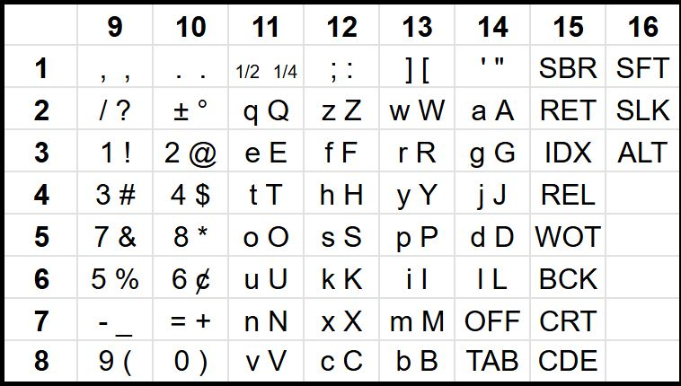

The next step was to inspect the signals on the output pins using my scope as seen below. As you see,the output pin produces a nice neat set of pulses --already something that was missing from the Panasonic T36. 

The next step was to check out multiple pulses using one of our logic analyzers. For this I needed to find a cable that could be used with the keyboard header. I ordered these cables from Kortech via digikey and they were a bit pricy at $5.90 a piece and a minimum order of 10, but in for a penny, in for a pound as they say. I also found some inexpensive connectors that looked like a good match. They do work, but are not designed as mating connectors so I am looking for a better match. 

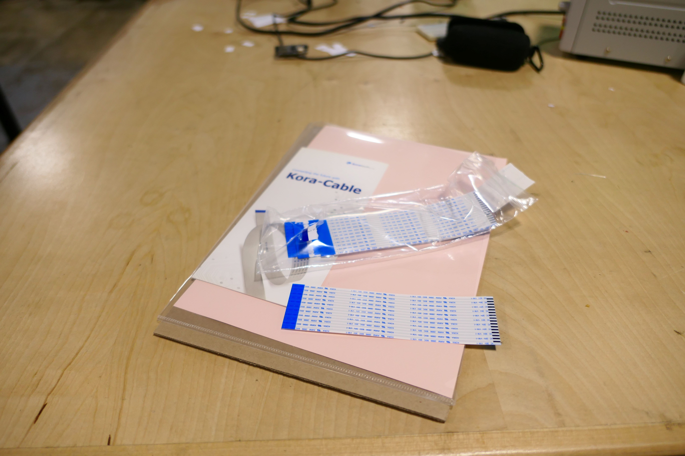

As you can see the connector can be made to work with this cable, but both the connector and cable get damaged in the process. 

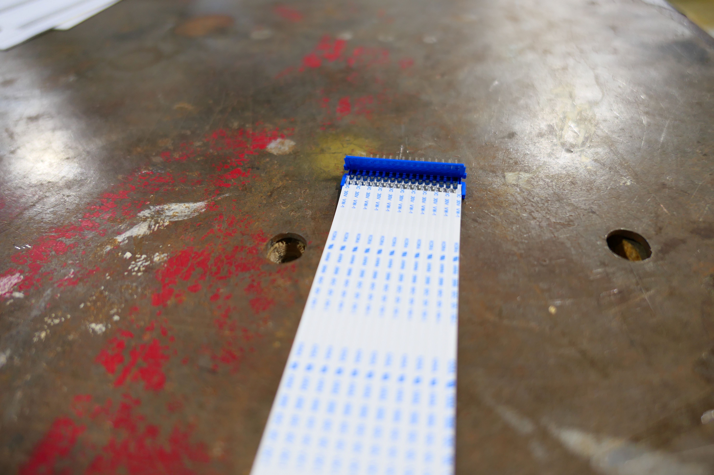

Using this cable I was able to connect four channels of the logic analyzer as seen below.

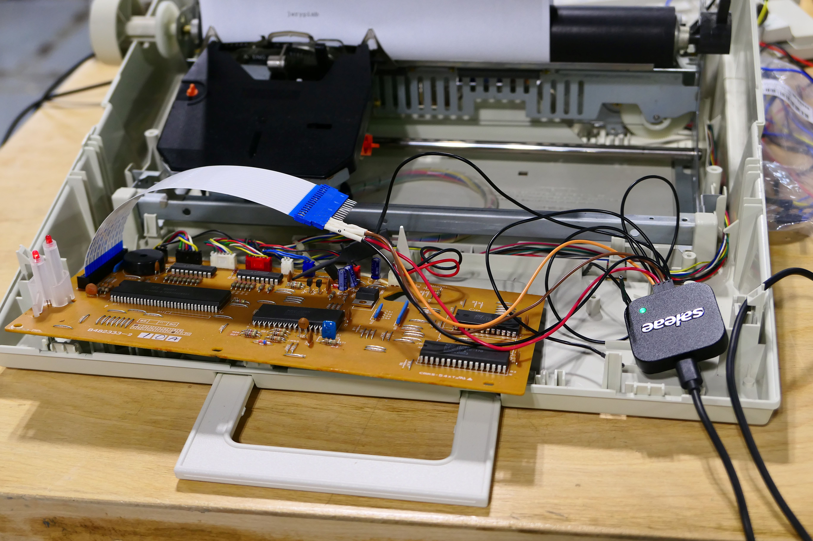

And here are the signals from the first for channels. Notice the nice neat order of the pulses as they progress from pins 1 to 4. You might think, well of course, this is how technology should be designed, but having worked initially with the Panasonic T36 I can say this is not a given. And here is where I have to mention the superior engineering of the Brother AX-350 over the Panasonic T36, a difference that is worth its own post.

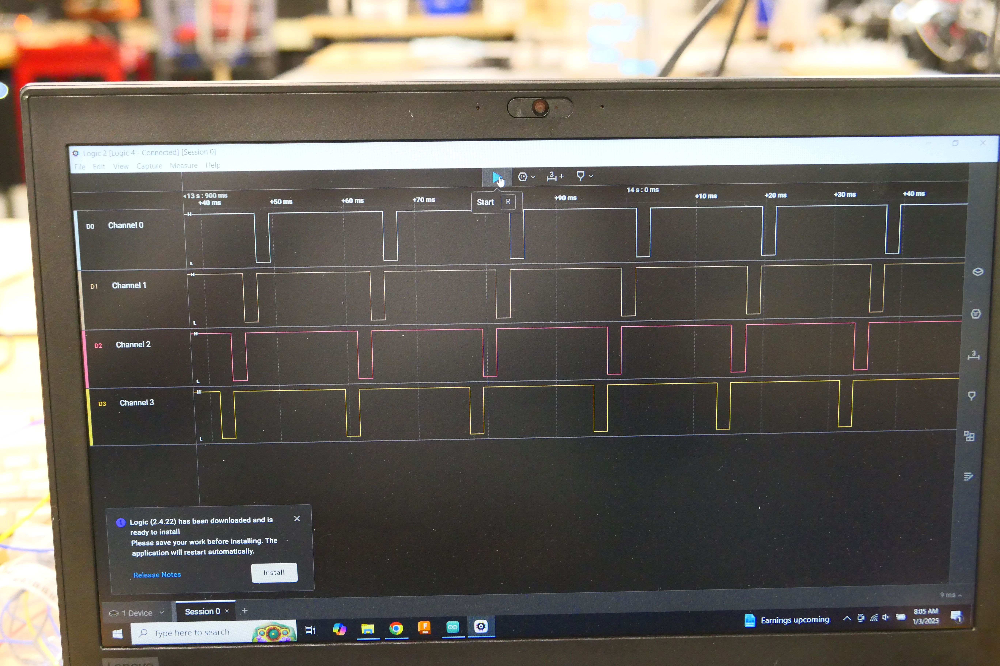

And now on to building the initial circuit, whose design has been made much easier due to the quality engineering in the AX-350. My initial circuit includes an 74HC151 multiplexer that allows me to select which of the eight input signals (pins 9-16) I want to read, and a 74HC138 demultiplexer that allows me to select which of eight output channels (pina 1-8) I want to write to. The channels on the 74HC151 and the 74HC138 are numbered 0-8 and can be addressed using three address pins on each IC for a total of six address pins. 

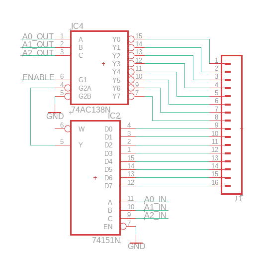

Note that all of the parts for this circuit can be found in our shop's extensive set of parts boxes as seen below.

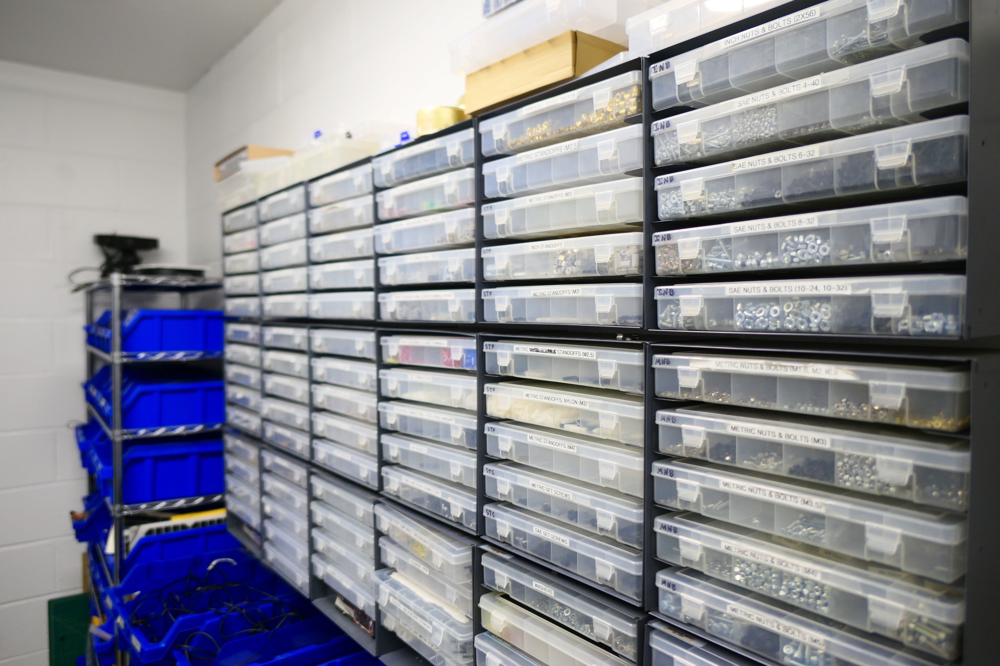

And here are the 74HC138s

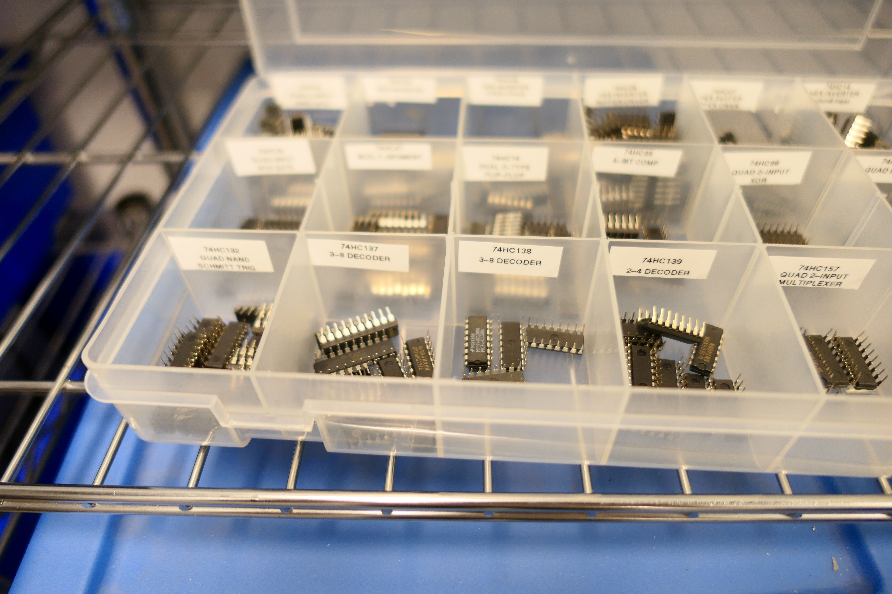

I using a MCP23017 port expander to set the addresses for both the multiplexer and demultiplexer. The MCP23017 has a total of 16 i/0 pins only six of which are required for addressing the two ICs. 

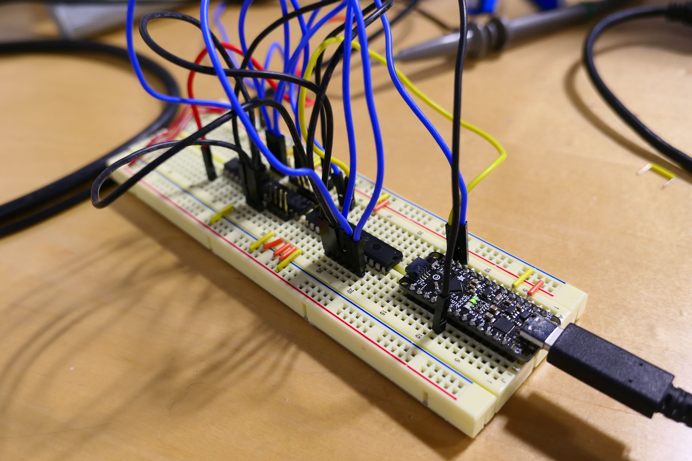

Initially, this circuit is being tested with an Adafruit Arduino Metro Mini 328 V2 which are based on the ATMega328p. We used these boards extensively in our shop. In the initial test, I am sending a PWM signal from the Metro Mini to channel 3 of the 74HC151 and reading it on channel 7 of the 74HC138. As you an see on the scope, the signal is being channeled correctly. 

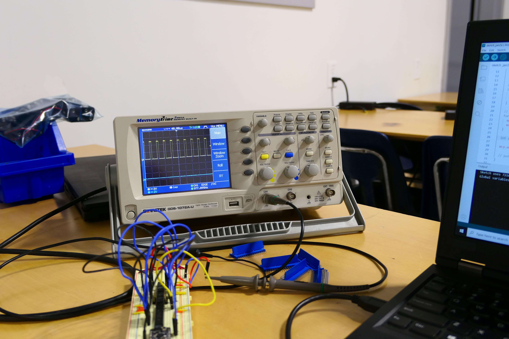

Finally, you can see the circuit connected to the typewriter and allowing me to type any character.

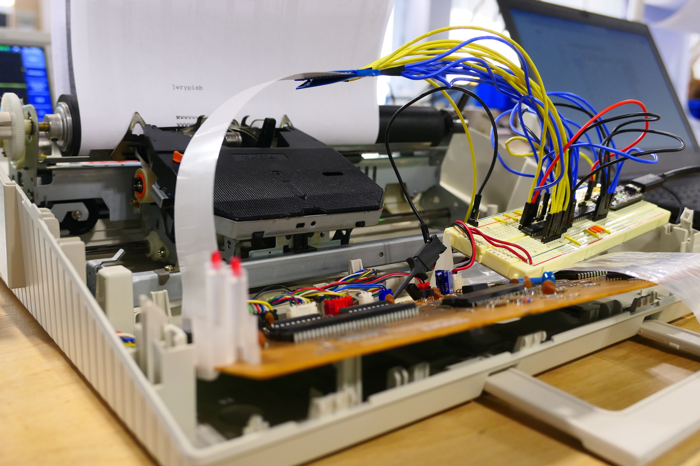

In the next post, I will modify the circuit to allow for typeing two keys simultaneously to enable SHIFT for uppercase letters and ALT for commands. In a latter post I will cover the code for the project. 

As always, I encourage you to check out our [shop's website](https://mvthsengineering.com/). 

