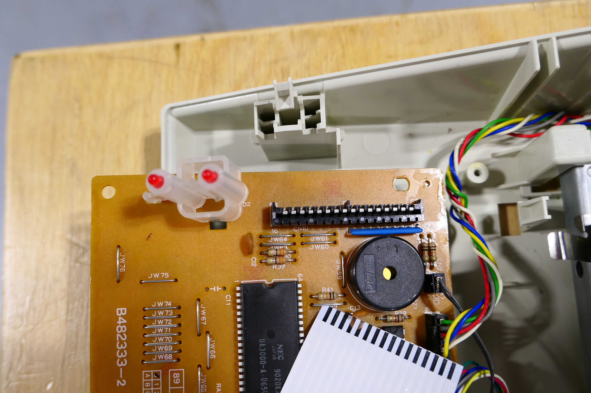

It types! Above you can see the correct sequence of characters for pin 13 from the key grid I made in the previous post. These characters were typed by using a jumper cable to connect pin 13 with pins 1-8 in sequence. In the picture below you can see the 16-pin header for the keyboard cable. If you look carefully, you can see that the last pin on the is labeled 16. 

