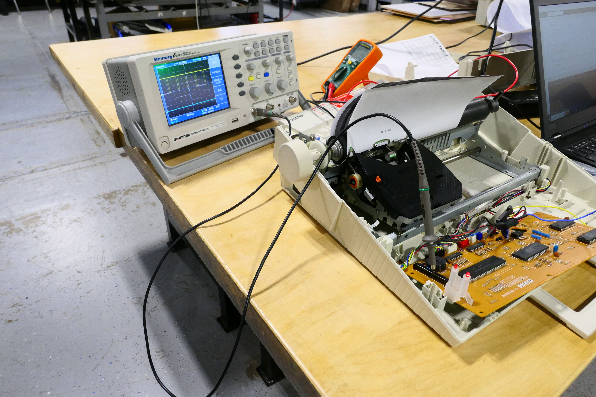

It types! Above you can see the correct sequence of characters for pin 13 from the key grid I made in the previous post. These characters were typed by using a jumper cable to connect pin 13 with pins 1-8 in sequence. In the picture below you can see the 16-pin header for the keyboard cable. If you look carefully, you can see that the last pin on the is labeled 16. 

Note that the 16 pins are neatly divided between inputs and outputs. The inputs are pins 1-8 and include pull-up resistors. You can see the blue resistor net next to those pins. Pins 9-16 are output pins. When an input pin is connected to an output pin a character is typed or a command is sent to the type writer. I have included the character grid from the previous post for reference. 

The next step was to inspect the signals on the output pins using a scope as seen below. As you see a nice neat set of pulses. Already something that was missing from the Panasonic T36. 

The next step was to check out multiple pulses using the logic analyzer. For this I needed to set up a cable that could be used with the keyboard header. I ordered these cables from Kortech via digikey and were a bit pricy at $5.90 a piece and a minimum order of 10. But in for a penny, in for a pound as they say. I also found some inexpensive connectors that looked like a good match. They do work, but are not ideal and I am looking for a better match. 

As you can see the connector is a fairly good match and can be made to work, but both the connector and cable get damaged in the process. 

