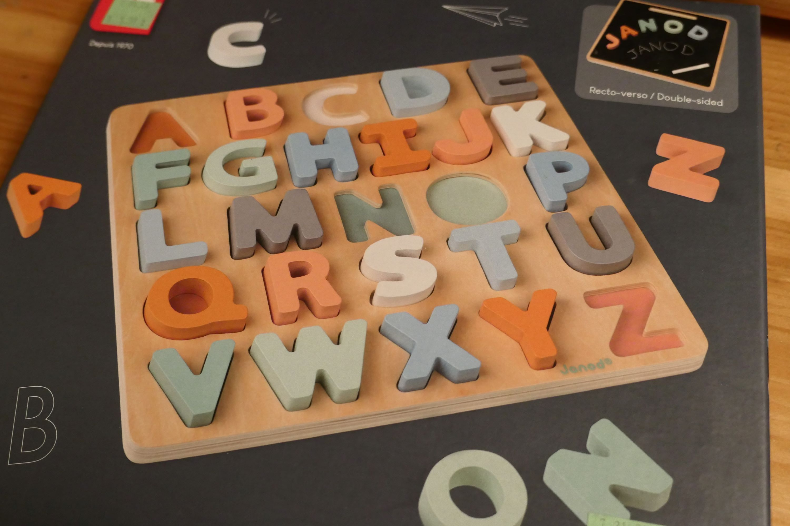
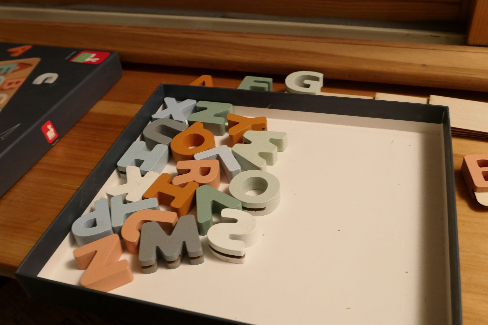
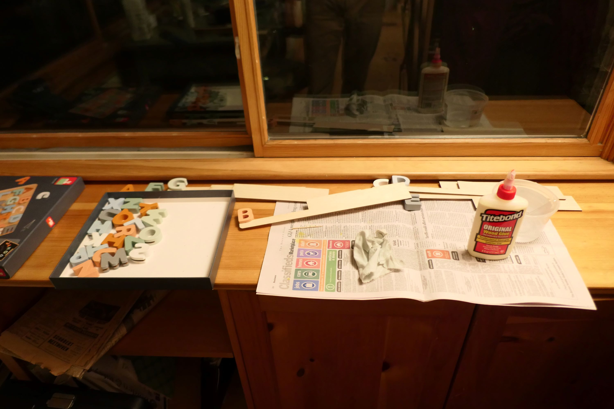
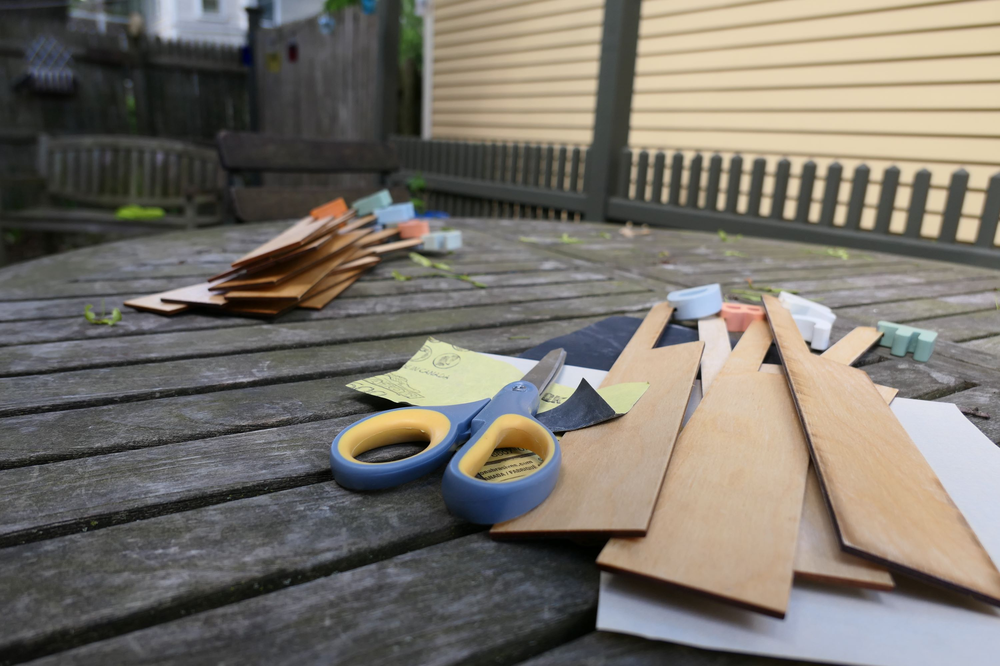
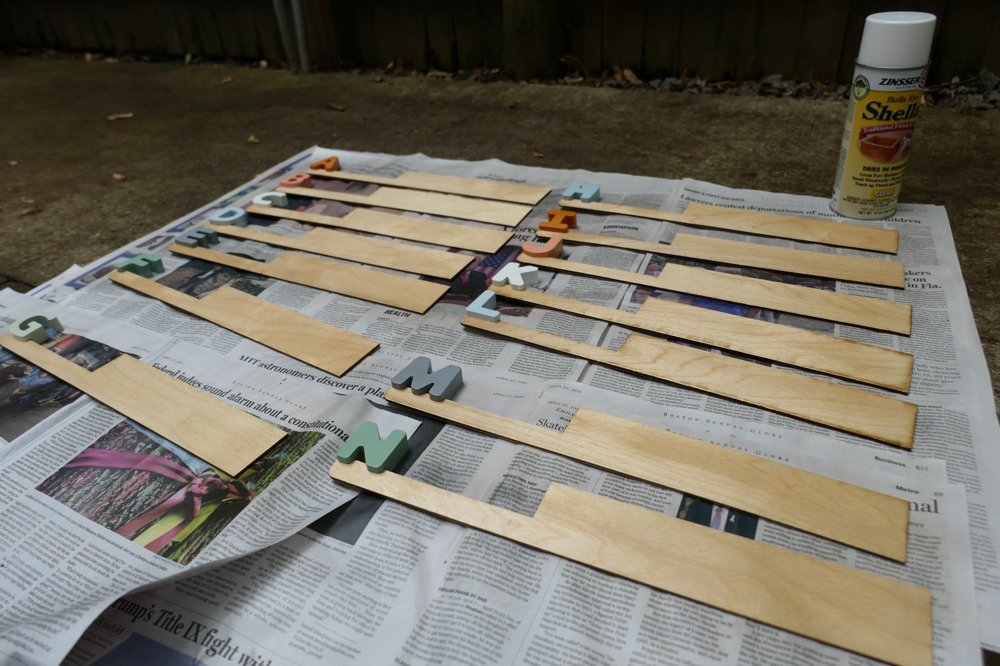
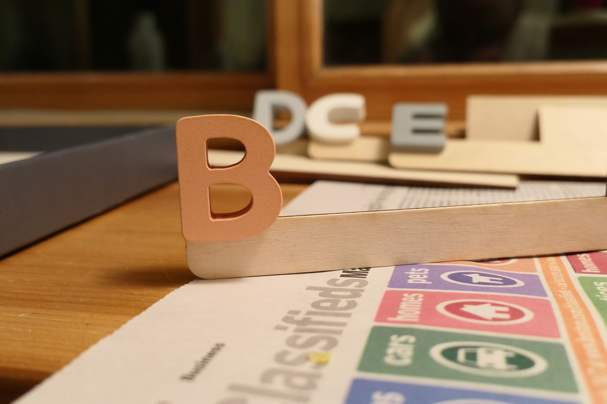

 
I purchased this box of letters along with a small chalk board at our local Goodwill store. 

The chalk board became a note pad in our kitchen and I decided to use the letters to help alphabetize our record collection. I first had the carpentry students at our school cut small grooves in the bottom of each letter.

Next I cut out slats to hold the letters using our shop laser cutter and scrap pieces of wood. 

I then glued each letter to a slat using wood glue.

Then I sprayed the glued letter slats with a few coats of shelac.

Finally, I sanded each slat for a smooth finish.

You can see a closeup of a finished here. 

