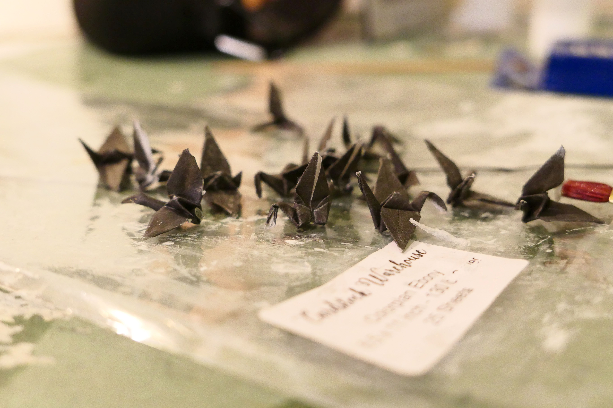
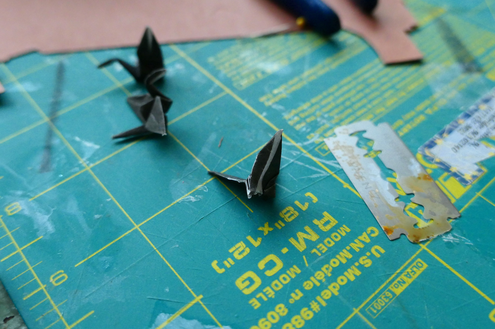
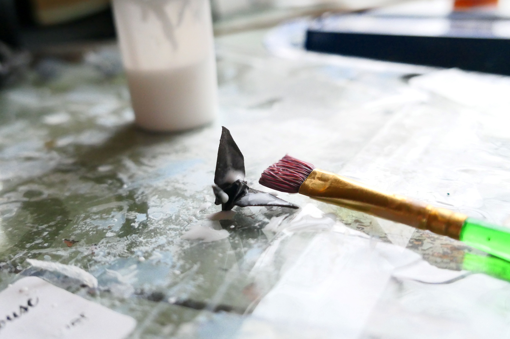

For my 60th birthday my family along with nieces and nephews took me out to dinner to Changsho a local Chinese resturant. The napkins at the table were held in strips of black paper, and someone in my family, I don't remember exactly who began making paper origami cranes. We were sitting at a large round table and it turned into an assembly line with each person perfoming one or two folds as the cranes slowly evolved around the table. In the end, I think we completed close to two dozen cranes. Taking them home I thought I am sure I can come up with a fun way to perserve these. 

My idea was to create an image of cranes flying in formation out of a white background and held in a simple frame. The first step was to mock up the design by carefully cutting a few of the cranes so they would appear to be partially in the white surface background.

Next I needed to paint the cranes with a few couple of Powertex, a high quality paper hardener. I also painted the white background.

