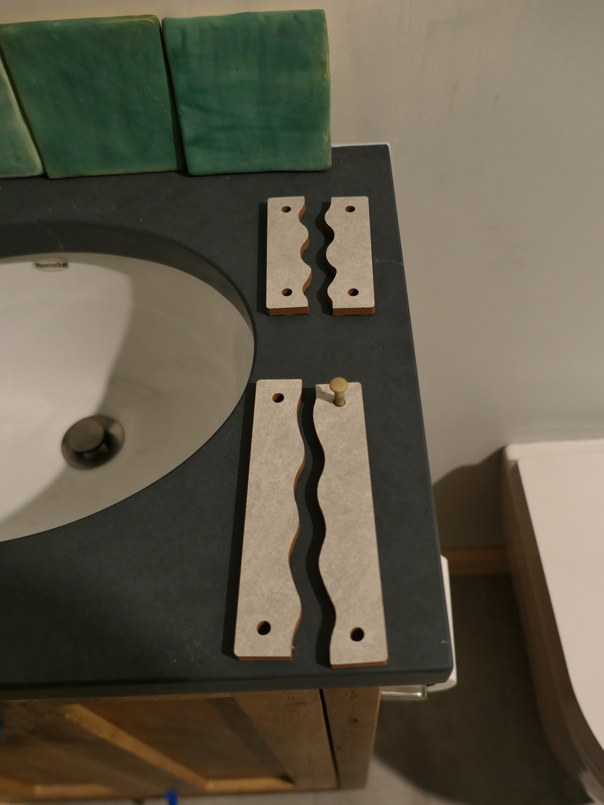
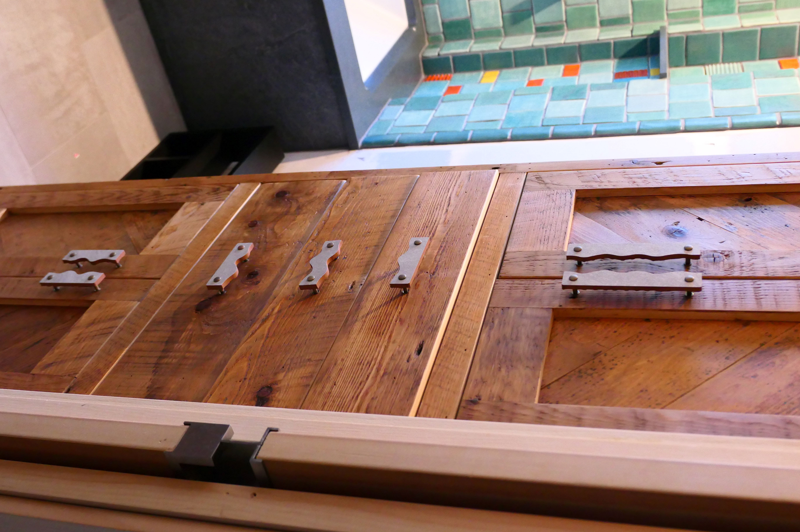

Last year my wife and I were designing pulls for our cabinet and we came up with for matching pieces. I cut them out of a spare bathroom tile from my school just as a test, but decided that the tile cuts looked great, so I used them on the cabinet.

I designed the tiles in CAD and cut them on our water jet. 

Below you can see the tiles before I placed them on the cabinet. I attached them with oil rubbed bronze mounting ferrule which I sandblasted with a light grade to give help them match the texture of the tile better. I purchased the ferrules from Uniqantiq Hardwaresupply but it looks like they no longer stock them. 

And here is the final version. I also placed the same pulls on the vanity. 

