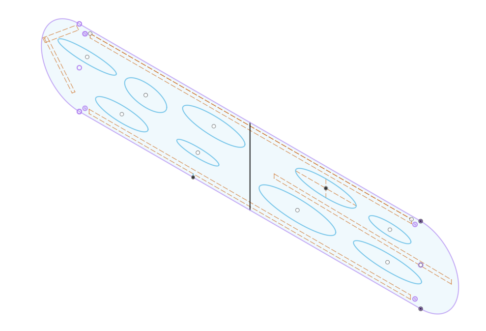

I call low warm lighting cozy. My wife calls it dark. As a result I have agreed to design a bright (though still warm) for our first floor, but because we already have two hanging lamps in the space, I want this one to almost disappear, essentially providing bright light from thin plate of metal.

The CAD design for the light is shown below. The plate is 44" long and 8" wide and includes the cutouts shown below.

lThis is a lamp that I have been working on for many months. The goal is design a lamp that can provide the maxium

## Pin Swing Arm

