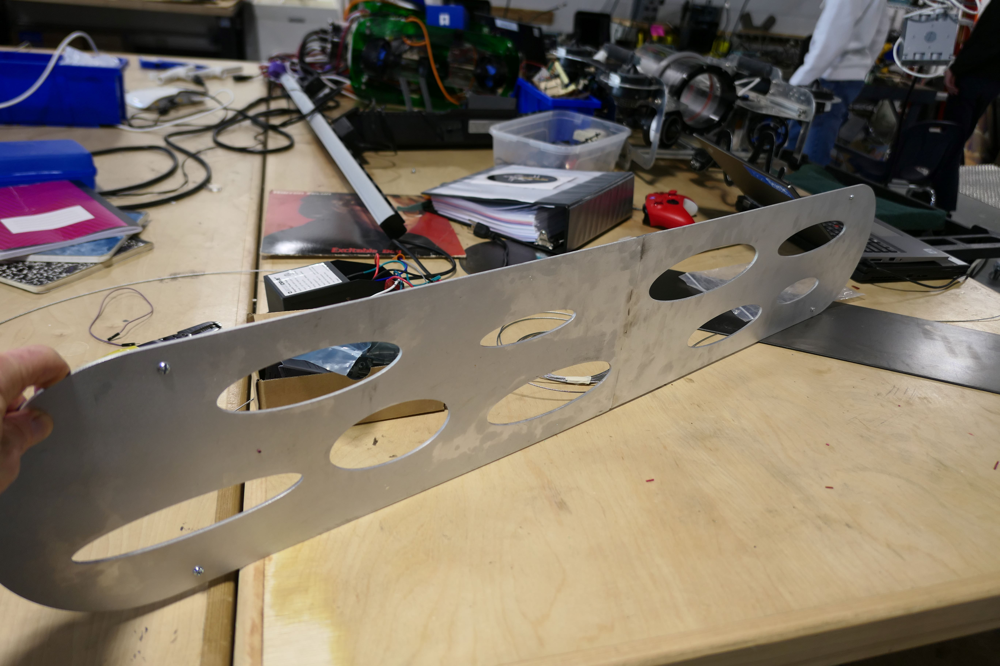

I call low warm lighting cozy. My wife calls it dark. As a result I have agreed to design a bright (though still warm) for our first floor, but because we already have two hanging lamps in the space, I want this one to almost disappear, essentially providing bright light from thin plate of metal.

The CAD design for the light is shown below. The plate is 44" long and 8" wide and includes the cutouts shown below.

Notice that there is a line in the middle of the sketch. This is because the enire piece is much too large to cut by itself on the waterjet. Below you can see the two pieces cut separately on the waterjet.

In the upper half you can see lines marked for where the LED strip will be placed. In the lower half you can see where these lines have been routed courtesy of Ben Wirz. The goal is to place the LED strips below the surface of the metal plate so that they cannot be seen from the side. The goal is make the plate appear to be glowing with no obvious source of light.

Another problem was welding the two parts together. This was accomplished courtesy of Mr. Jackson. As you can see below the weld line is still visible. I am planning to use some aluminum filler to help remove any trace of the line. 

