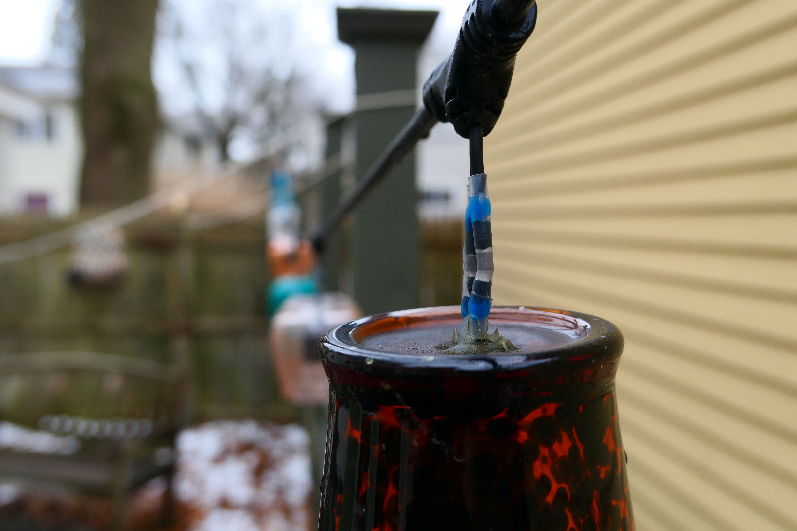
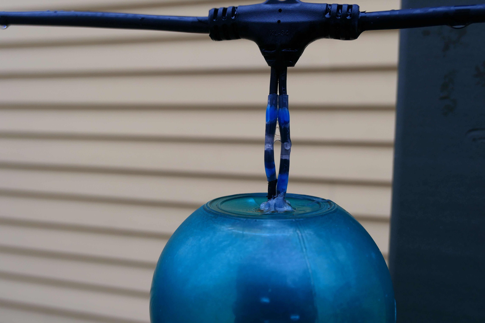
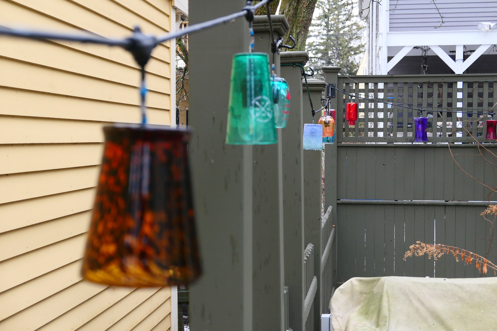
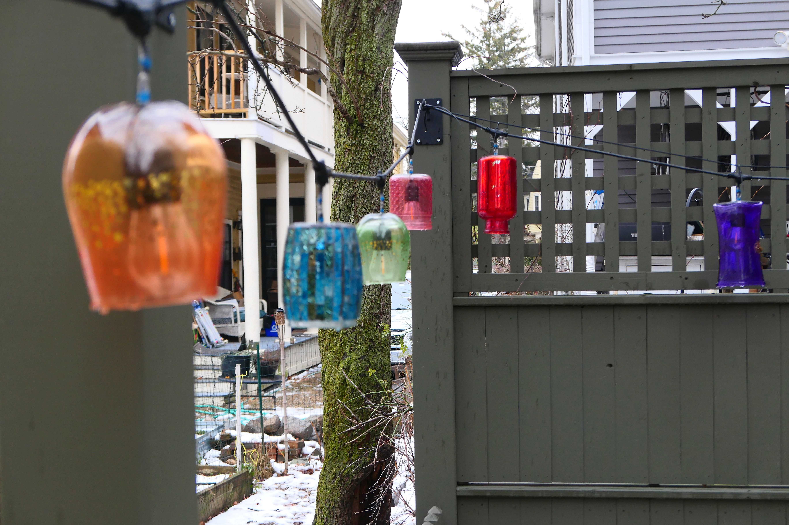

A couple of years ago, I began gathering colored glass and small vases from Goodwill. When I had a good collection, I combined them with a couple of sets of outdoor string lights to make colored lights for our backyard.

I drilled a hole in each of the glasses using glass hole saws. I then cut off each light in the string placed the socket in the glass. Next I tined the end of each side of the wires with solder. I placed the two ends inside of each waterproof solder connector and then used a heat gun to seal them. The blue rings create a watertight seal. In the middle is a ring of solder that melts into the tined ends of the wires and forms a tight bond. The connectors are not only watertight they able to support the weight of the lights. 

 

Here they are in the day light. 

If you can see at the end are a set of larger vases. Because these were heavier, I was afraid it might stress the power cable so I tied paracord to remove stress from the wire.

Also the original hangers (see below) were not designed for a lateral stress, so I custom made the four hole plates and had my friend weld on the hooks. 

And here they are at night. 

