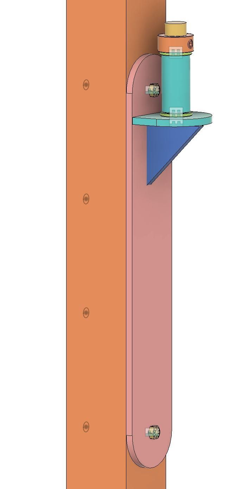
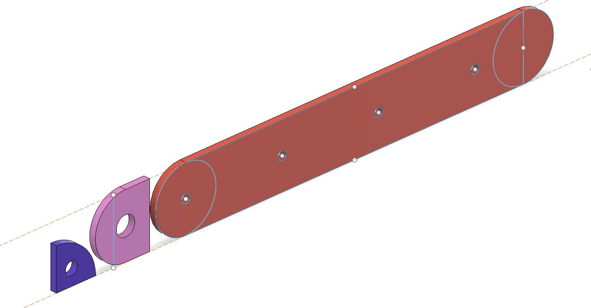
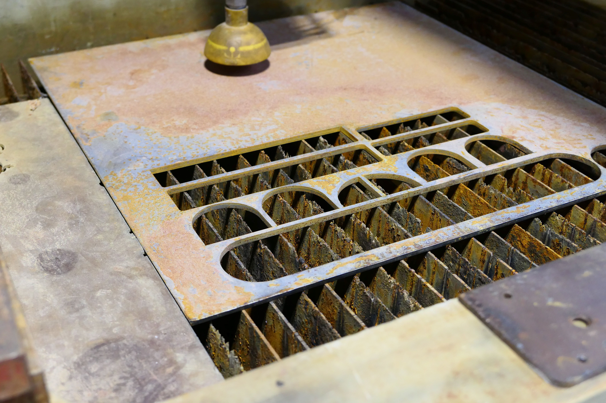
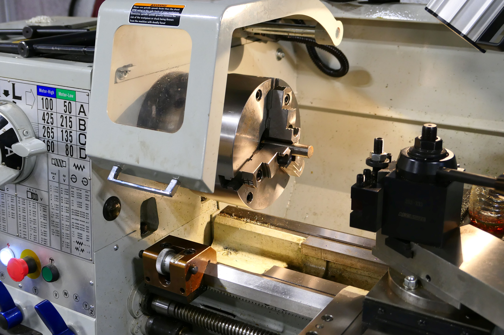
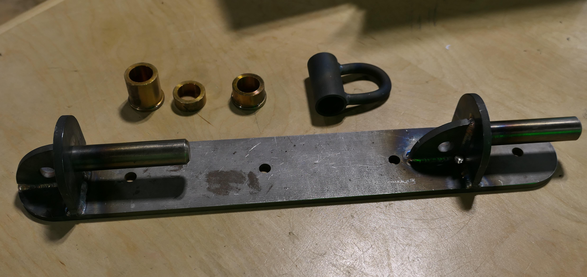
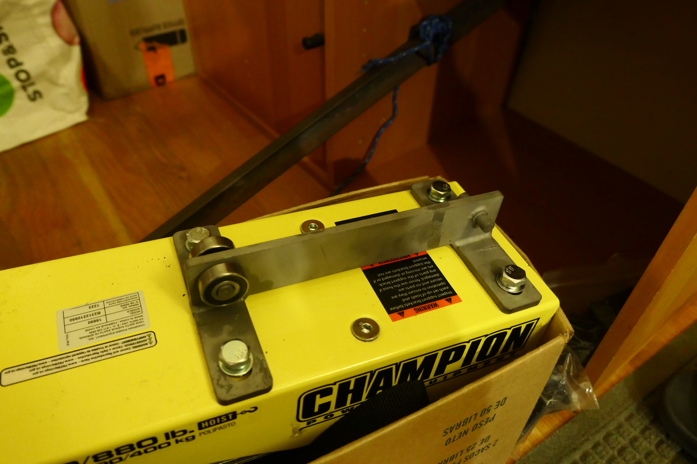
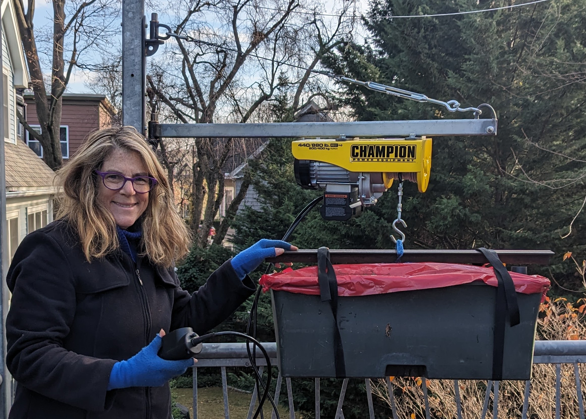

A year ago, I designed and built a jib crane in order to move our planter boxes over our deck railing. My wife designed the railing with planter box cradles on the outside and low down near the gutters. This would allow our tomato plants and other veggies to grow as tall as possible. And while the railing is designed to be removed, it is still hard to lift the planter boxes even with the railing removed. The entire crane was built from scratch using mostly scrap metal from around the shop. 

## Pin Swing Arm

The crane base employs two identical pin swing arms. You can see an early CAD model below. In the model you can see the pin in yellow and the sleeve in green. Between the pin and the sleeve are two corrosion-resistant flanged sleeve bearings. One in the top and one on the bottom of the sleeve. I cut the pins from a steel rod and turned them to match the exact diamter of the bearings. I cut the sleeves from a steel tube and again machined them to match the bearings. The supporting base was changed from a triangle to an arc before the final version.

Below you can see a model of the pin for the swing arm. 

## Pin Base

I cut the base from quarting inch steel plate using our water jet. You can see the manufacturing design below. What is not shown is that I machined each of the pin bases to create a channel for the weld. 

And here is a picture of the steel plate in the waterjet. Note that I need to cut extra pin bases, because I needed to redo the initial machining. 

Here is a picture of our South Bend Lathe with the first steel rod before I got set up to turn it.

## Complete Base

Below is a picture of the completed base. I had my friend in the metal fabrication shop at our school weld the pieces together for me. You can also see the bearings here. Since on of the sleeves is shorter, I had to cut the bearings to fit. 

## Final Crane

You can see the final crane here. I used a piece of Unistrut for the crane arm and cable a turn buckel and s-hooks for the remaining side of the triangle.

## First Trolley

The first trolley I designed employed a bearing assembly that I purchase and can be seen in the picture below. I designed and built the mounting bracket that holds the bearing assembly. We used this for the first year, but because of the distance between the bearing and the actual hoist, it was hard to lift the planters over the railing. Their is not a lot of distance between the crane arm and the top of the railing so in terms of making the crane more usable, inches matter.

## Second Trolley

This year I improved the trolley making it as a single unit. This one is both more stable and creates a better clearance for the crane.

## In Use

Here you can see the crane being used to move our planter boxes.

