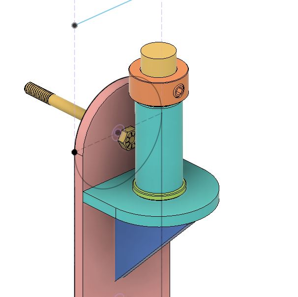

## Introduction

A year ago, I designed and built a jib crane in order to move our planter boxes over our deck railing. My wife designed the railing with planter box cradles on the outside and low down near the gutters. This would allow our tomato plants and other veggies to grow as tall as possible. And while the railing is designed to be removed, it is still hard to lift the planter boxes even with the railing removed. The entire crane was built from scratch using mostly scrap metal from around the shop. 

## Pin Swing Arm

The crane base employs two identical pin swing arms. You can see an early CAD model below. In the model you can see the pin in yellow and the sleeve in green. Between the pin and the sleeve are two corrosion-resistant flanged sleeve bearings. One in the top and one on the bottom of the sleeve. The pins were cut from a steel rod and turned to match the exact diamter of the bearings. The sleeve was cut from a steel tube and again machined to match the bearings. 

