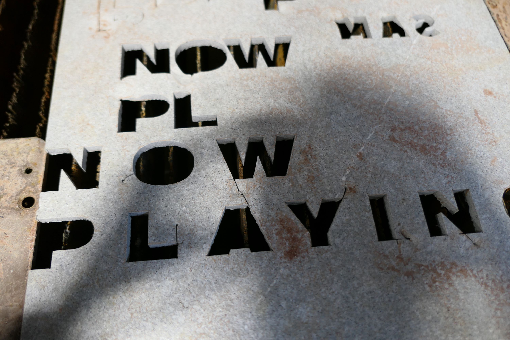
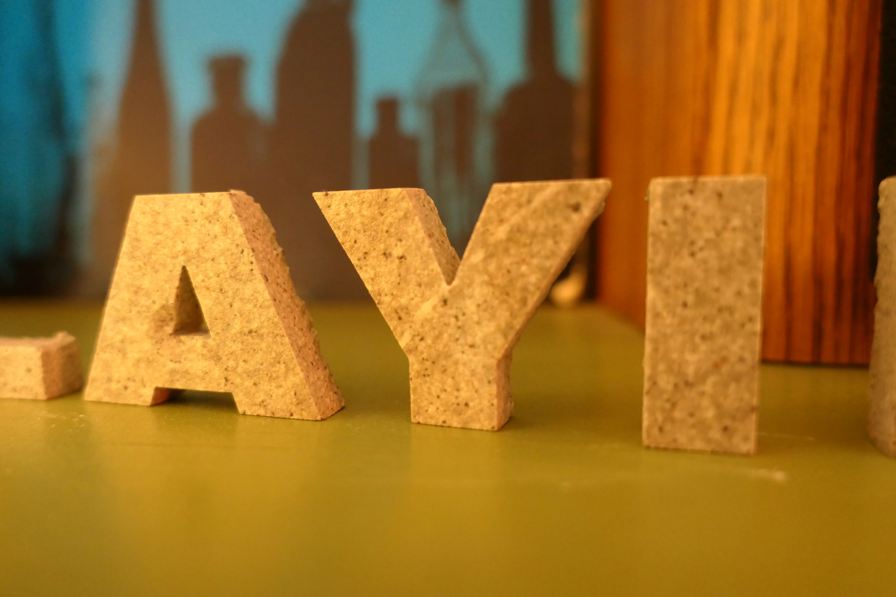
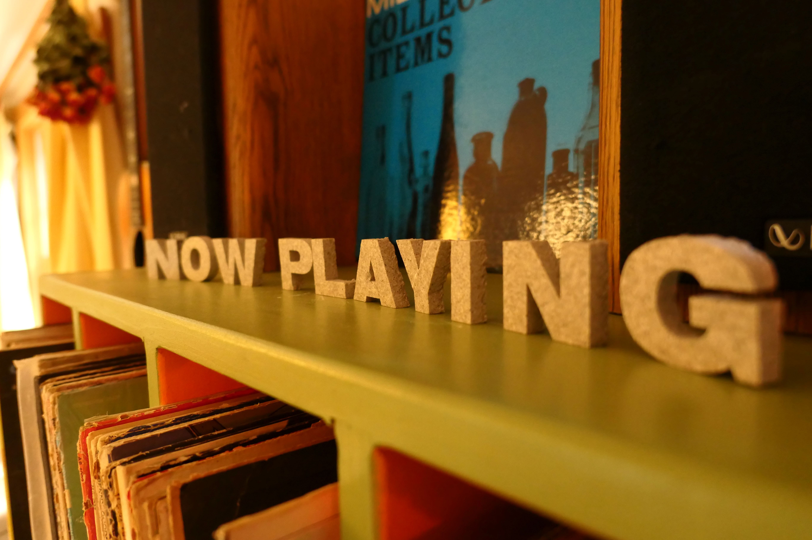

For a long time, I have been meaning to upgrade the small paper "Now Playing" sign infront of the cover of the album on the record playing. Having some experience cutting cabinet handels out of floor tiles on the waterjet, I decided to try and cut letters. Cutting ceramics on the waterjet is tricky as it tends to crack the tile each time the jet starts a line. Below you can see craters made when the jet first starts a cut. But with carefully setting the leadins I was able to cut all the letters fairly easily. 

The other problem is that the small letters fall through the metal slats after cutting. The bottom of the waterjet pool is too deep to reach by hand, but I have set up a screen below the slats to catch letters when they fall through. 

Here you can see a few letters.

And here you can see the final set of letters.

