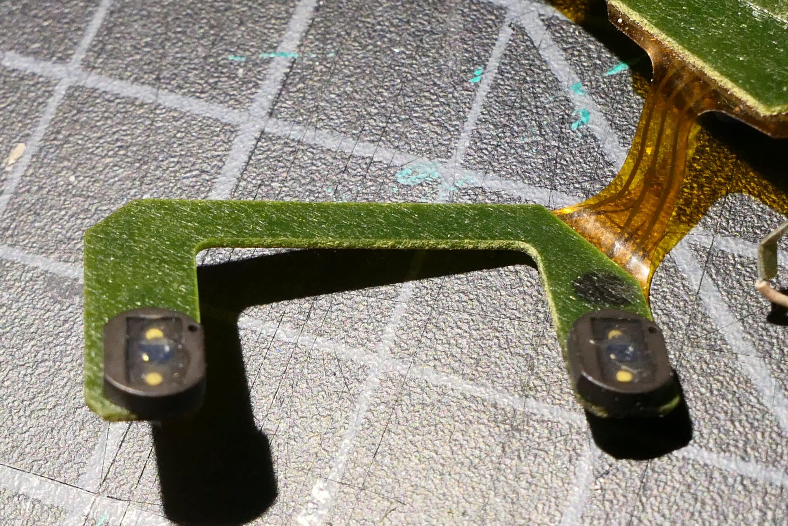
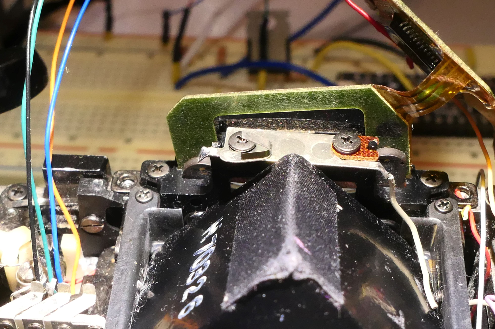
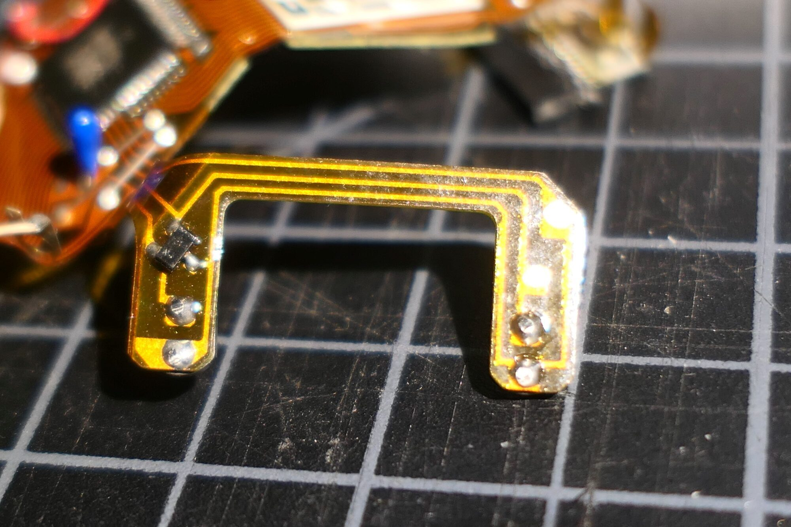
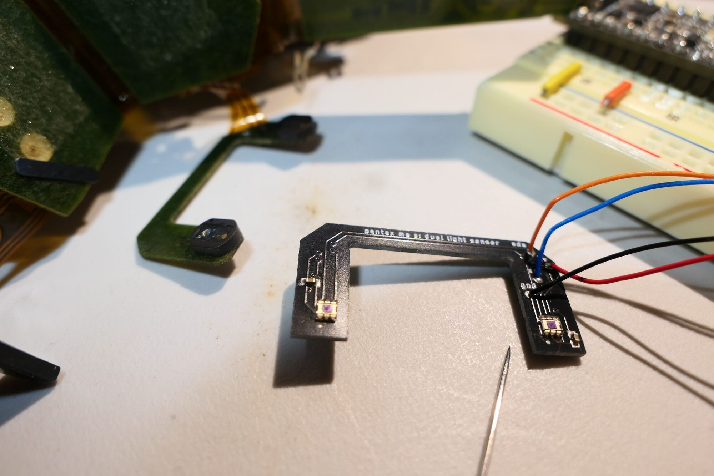

---https://github.com/medfordengineering/mrchristysengineering/tree/master/_posts/PentaxMES-LightSensor
layout: post
title:  "Pentax MES RetroMod (light sensor)"
categories: [ Jekyll ]
image: ./ZZ-coverart.JPG
---
This post represents a continuation of my work to retro-mod vintage film cameras as detailed in my post Rangefinder RetroMod part 1. The reason this is not part 2 of the original post for the simple reason that I shifted focus from rangefinder cameras for the moment. This post will be dedicated to my attempts to design an improved light sensor for the Pentax ME Super and develop an improved light sensor design that can be used in multiple cameras.

## The Pentax Sensors

The Pentax ME Super use two photodiodes for sensing light. In the first picture below you can see the PCB with the two photodiodes. The second picture shows how they slide in on either side of the view finder. 

Here you can see how the two photo diodes (seen from the back) are connected by what appears to be a single transistor before going into the MCU. There is no evidence of an opamp on the circuit at all. 

## Photodiodes vs Ambient Light Sensors

With regard to replacing these sensors, I have gone back and forth MANY times on whether to use an integrated logic level ambient light sensor or a photodiode. The integrated sensors come in a single package. They generally talk I2C. They cover a wide range of the visible spectrum and they do not require a separate analog to digital converter. On the downside, there is a limited selection of these devicee. They require a software library. They are really, really, really small, with no-lead packages. Many, surprisingly, have fixed addresses meaning that you can't easily have two or more more on the same bus. Below you can see the first board I made using a pair of OPT3001 which includes a clever way to select one of four addresses. 

Note that the PCB is the same dimensions as the one it is replacing including a .8mm thickness which is available from JLCPCB. Soldering these tiny sensors proved to be as difficult as I imagined. This board was soldered using our Cuisinart reflow oven. One of the two sensors worked. The other failed for a reason that was impossible to diagnose. I made a second board and both failed with short between power and ground. Both of these were soldered without a stencil. I will be ordering the stencil and trying again as soon as it arrives. I am a little more hopeful. In the worse case, I could have JLCPCB complete the soldering.
