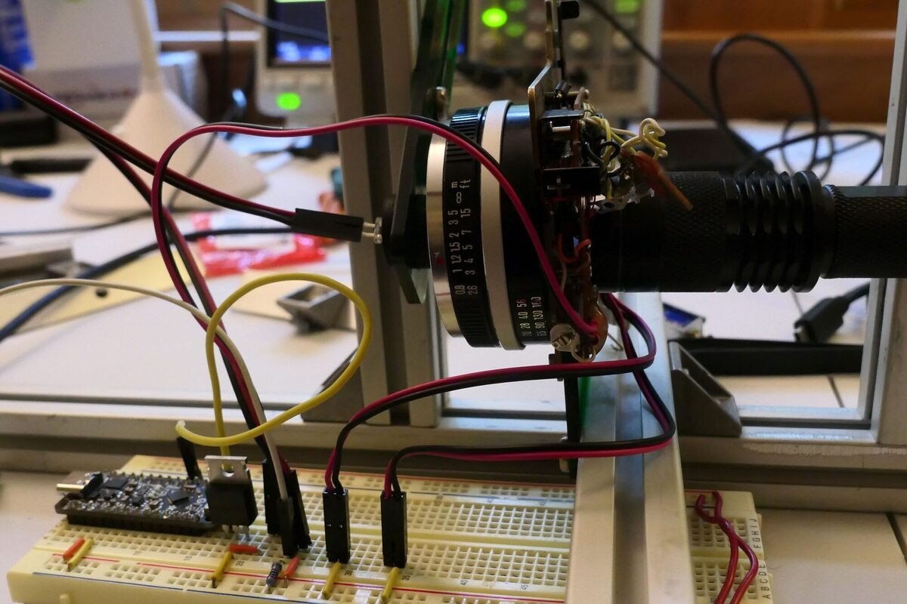
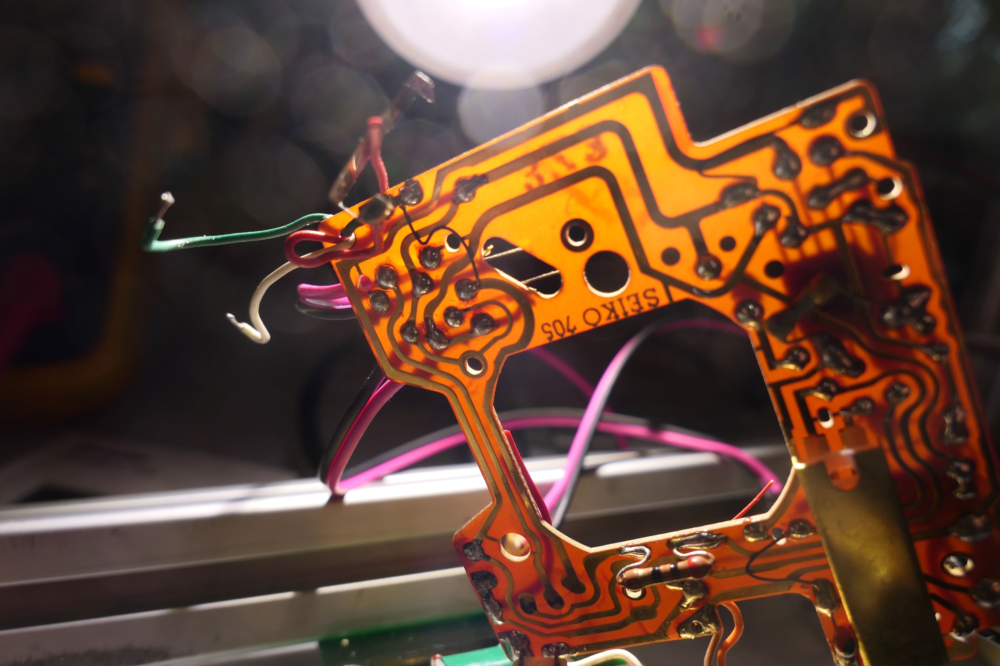
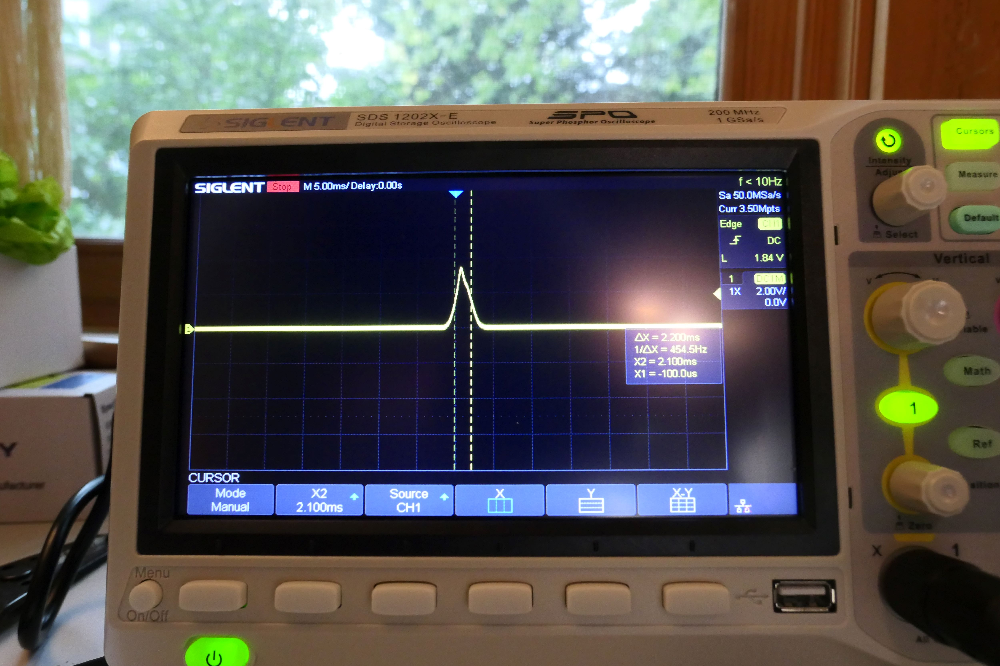

For the past couple of years, I have been shooting film again, mainly with 60s and 70s era rangefinder cameras. The idea of creating a restomod film camera began with my Minolta AL-E. It is a great camera, but the meter no longer functions correctly. I thought about replacing the topside needle meter with a digital meter, but stopped short when I realized that controlling the shutter speed on a fully mechanical camera would be challenging. Sure, I could just control the aperture, but I really wanted to perform a more complete mod. I set my sites on one of the late sixties, early seventies cameras with an electro-mechanical shutter. Yashica, Minolta and Olympus all made a few.

One of the great things about working on a restomod is that you can purchase the cheapest camera since you are going to rebuild most of the mechanisms anyway. I purchased a Minolta Hi-Matic F for $40 including shipping and a flash. Fortunately, the lenses were in good shape which is all that really mattered to me. The F has a 1/2.8 lens which makes it easily pocketable. It advertises shutter speeds from 4 seconds to 1/724th of a second. More about shutter speeds next.

My initial goal was to take apart the camera to see how the electromechanical shutter worked. Below is an image of the top of the camera with the top plate removed. 

The large plate on the left that looks like the map of Oklahoma is the rangefinding unit. Underneath that is where the flash mounts and if you look carefully on the right there is a trigger that moves when a flash is inserted into the camera. A long term plan is to control flash compensation as well.

As a next step I was able to keep the entire front plate and shutter mechanism intact. The picture below shows one side of the brass front plate that holds the lens. This plate is bolted to the camera via four screws. This general design seems common to all rangefinders of this era that I have explored. Note that the lens and electronics were manufactured by Seiko. This model is the Seiko ESL. 

Here you can see the plate removed from the camera. Note that the rangefinder has also been removed and additionally came free intact. 

Below is an image of the entire shutter mechanism. Only the two wires controlling the solenoid have been cut. 

On the lower right is the shutter trigger. The solenoid that controls the closing of the shutter is the green package mid right. Above the solenoid is a lever that controls the aperture. Note the shutter and aperture are one in the same on these smaller cameras. Lower left you can see a pin that sticks up between the circuit board which moves as the shutter opens and closes. Those long brass terminals are used to signal when the shutter is starting to open and when the shutter is fully open.

Here is a video showing the mechanism in action. I apologize for the poor video quality, but I do not have a good setup for making videos. On the lower right is the shutter lever mechanism. This loads the spring that will open and close the shutter. Once the shutter button is completely pressed, the shutter is driven open by a spring. The shutter is then held open by the solenoid. When the solenoid releases, this same spring closes the shutter. It is not clear to me the purpose of the spinning gears. They effectively slow down the opening of the shutter to about 1/60th of a second which would only make sense if this camera had a battery-free shutter setting. 

<iframe width="560" height="315" src="https://www.youtube.com/embed/IsEIHKR8s8k?si=UmUYxJO6NpyKH8bD" title="YouTube video player" frameborder="0" allow="accelerometer; autoplay; clipboard-write; encrypted-media; gyroscope; picture-in-picture; web-share" referrerpolicy="strict-origin-when-cross-origin" allowfullscreen></iframe>

Below you can see where I have soldered connectors for the solenoid. I added the hot glue to reduce strain on the fragile wires from the solenoid. Also, you can see where I have added a mount (green acrylic) to place the shutter in my speed tester. 

 Below you can see where I have soldered wires to the two limit switches that indicate shutter primed and shutter open.

Finally, you can see the shutter sitting in the test rig. When the light passes through the shutter it triggers a photodiode. All of this is captured on my oscilloscope.

At first I was getting odd results from the limit switch set when the shutter was primed. It appears that the switches were connected on the circuit board in a way that drove voltage to one of the terminals. Below you can see the circuit board and by simply cutting one of the traces everything returned to a happy state.

Finally, you can see the fastest shutter speed I was able to create. This used a software interrupt that fired the closing of the shutter as soon as it was fully open. You can see from the scope the speed is about 1/454th of a second, not the 1/724th claimed. First I will note that I have found  A LOT of discrepancies between stated shutter speed and actual shutter speed in most of my vintage cameras, even one that was CLA'd. Though the newer curtain shutter cameras fared better. The problem with high shutter speeds using leaf shutters and you can see it in the image below, is that the shutter itself can take almost 2ms to open and 2ms to close. This does not leave much time for a 1/500th of a second. It is important to note that because of this, shutter speeds for leaf shutters are measured from [mid-open to mid-close](https://archive.org/details/basicphotographi00stro/page/39/mode/1up/).

That said, I have not given up on a faster shutter speed. The shutter seems very clean, but I still might clean it with alcohol and see if there is any improvement. Another option I have in mind is to wind a slightly stiffer spring for the shutter. But before all that, I am going to control the shutter speed continuously and accurately from 4 seconds to ~1/500 of a second. Then determine a good way to control the aperture along with an improved light sensor. The plan is to control all of this from the top of the camera with a micro OLED display. Still a lot of work to do, but I am pleased with the first step.

