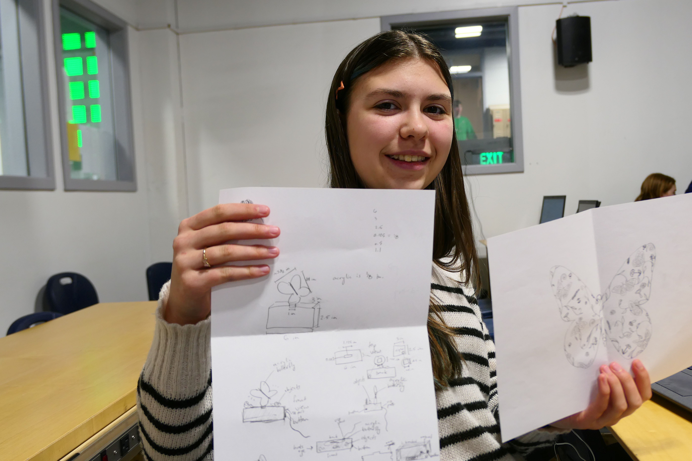

This post is a long overdue description of the Engineering and Robotics program at Medford Vocational Technical High School (MVTHS). I was asked to write up a description of our program for the a report to the New England Association of Schools and Colleges (NEASC). 

Our school will be undergoing an accredidation process next year and this inital report is part of the process. They choose to focus on our shop in particular as it meets one of the goals of this year's review: *students are active learners who have opportunities to lead their learning...through applications of knowledge and skills to authentic tasks and pursuit of personal interests and opportunities for creative expression.*

Students in the Engineering Technology Chapter 74 Career and Technical Education program at MVTHS spend over one-third of their high school time in shop. Starting in ninth grade, students begin learning the basic skills required to design and build just about anything. These skills include: designing electronic circuits, writing code for embedded devices, manufacturing circuit boards, designing parts in CAD and fully machining those parts on CNC machines. 

Students learn these skills by following a pair self-paced guides authored by the two Engineering shop teachers: one covers electronics and software and the other covers computer aided design (CAD) and machining. In addition, students in their sophomore year must complete two projects designed to test their engineering skills. Students are expected to design and build each of these projects using raw materials in the shop. The projects are intended to cover the skills they learned from the guides and they are the only projects in the shop that must be completed by a deadline.

The first project is a light box. The box is designed to illuminate an acrylic panel with limitations only on size and materials. This is the only graded project in the program and it is graded by the shop’s juniors and seniors following a teacher designed rubric.  As you can see, the results vary widely.

|First Image|Second Image|
|:-:|:-:|
||

The project begins with draft designs and notes in the student's engineering journal. The next step is to design an electronic circuit on a breadboard that will drive their light box. This breadboard design is than transfered to a schematic using an electronic computer aided drafting (ECAD) tool in Autodesk's fusion software. This schematic is then transformed into a design for the actual PCB that will be milled in the shop. Once these two steps are complete, the student can create a 3D model of their final PCB. 

The next step is to focus on designing a housing that will hold their PCB, the controls and the acrylic display itself.

The second sophomore project is to design a sumo robot for a competition held each spring. Again all robots are built from raw materials in the shop with some constraints on size and weight. The final competition is run completely by the shop’s juniors and seniors. Below are some photos of the project.

Having gained the necessary engineering skills during their freshman and sophomore year, juniors and seniors in the shop get to spend their time building whatever they want --that is “as long as it can fit in the shop and does not explode”. 

There are no project deadlines and no project grades. Students can work on a single project or work on a series of projects over their two years. Often complex projects take many more than two years to complete and are only accomplished by new students picking up where graduating students have left off. Students are expected to work independently on projects with the rare exception where a team is appropriate.

This freedom to design whatever they want at their own pace with no grading requirements is framed tightly within a weekly structure of setting expectations and reporting on progress. Every Monday, students are required to write out five measurable goals for the week and to assess both their progress on their previous week’s goals and their present goals with their teacher. In addition to setting a plan for the week, this allows the teachers to have a brief one-on-one check-in with every student. Every Tuesday, Wednesday and Thursday, each student must report to the class on what they completed yesterday and what they plan to complete today. By Friday, each student must have completed a blog post of their work for that week and present this post to the class. These presentations are graded. Finally, at the end of the day, each student is responsible for cleaning one section of the shop --returning the shop to the way they found it, and thus reinforcing the daily habits of effective work.

Each day students are graded from 0 - 10 based on their ability to stay focused on their task throughout the day. Students are not penalized for working slowly, nor are they rewarded for working quickly. Each student needs to find their own pace, but they must be working. Since not everyone is at their most efficient working continuously over three periods, students are allowed to take as many breaks as they need. Though a break is specifically taking a pass and going for a walk in the hallway. This way, students begin to develop a clear distinction between what it means to be fully on task and what it means to take a break. More than anything else, this program is designed to build the habit of productive and effective work.

And while we can’t state this for a fact, our engineering instructors feel that “These students are completing some of the most advanced high school engineering projects in the state.” Though if you take a look at this year’s projects so far, you can see why. 

