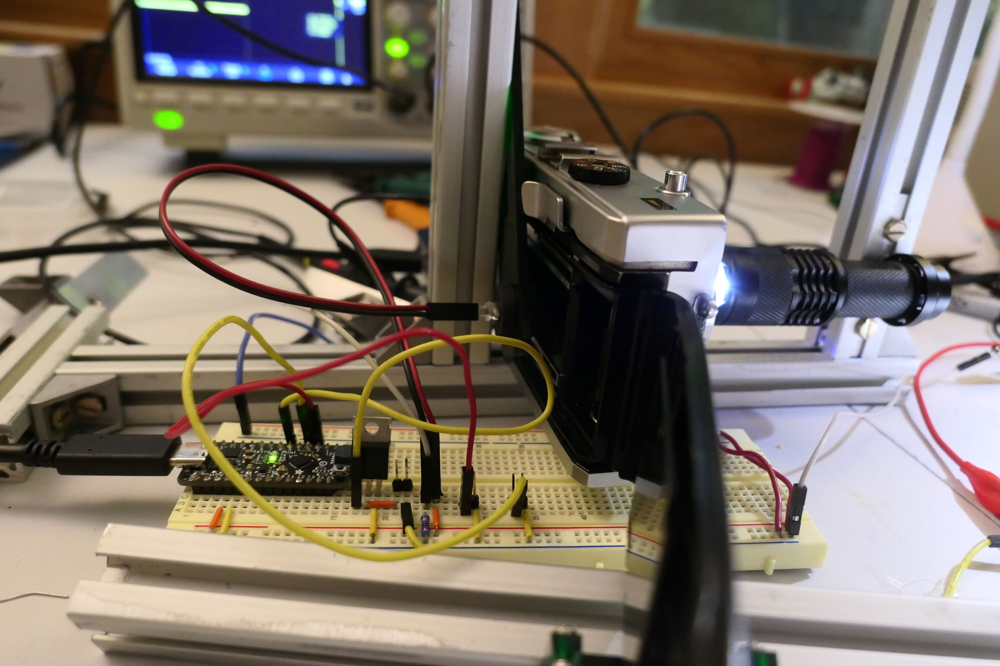
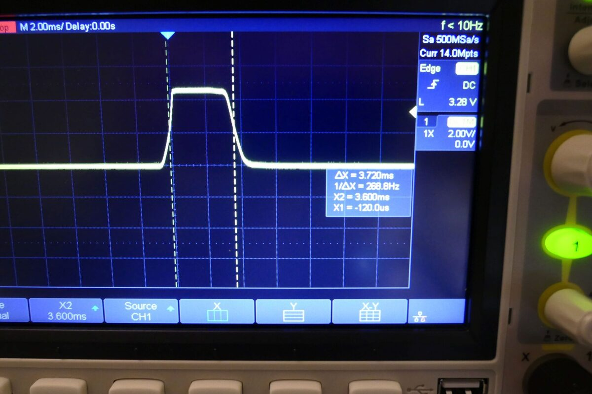
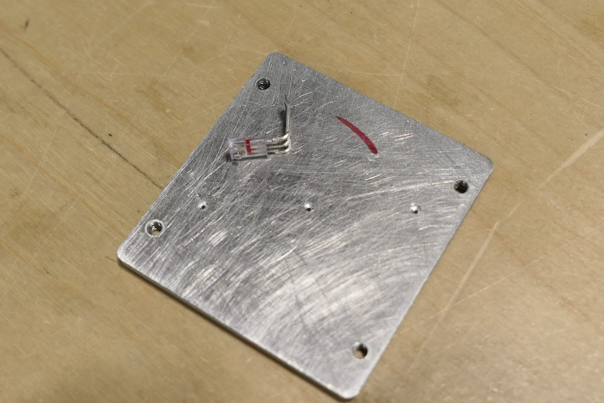
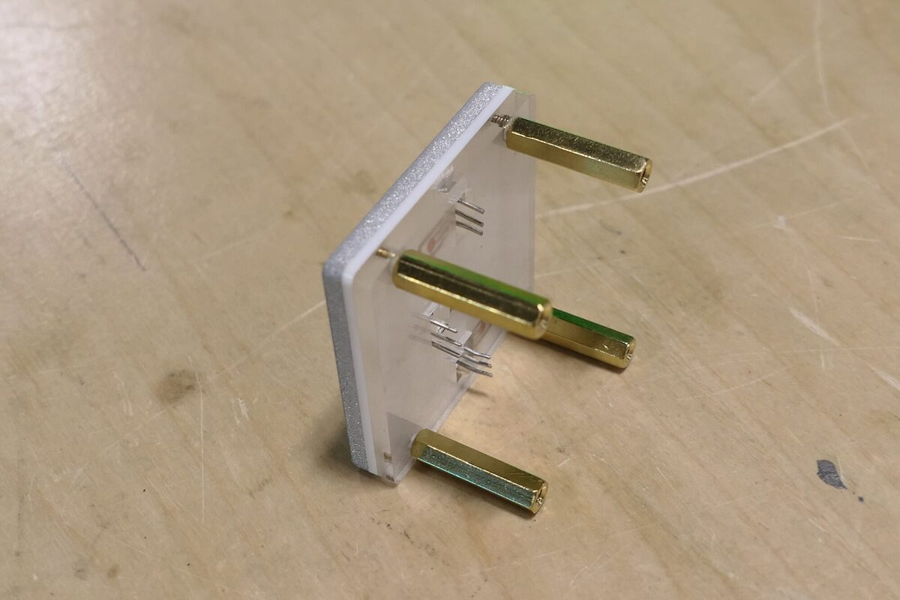
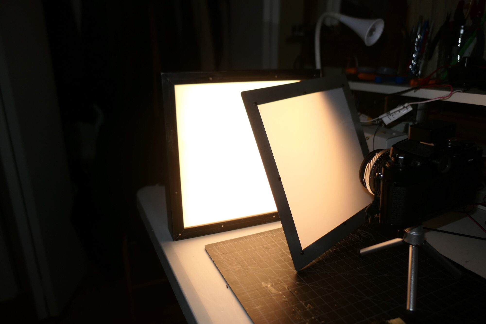

In order to any work on cameras, I needed a way to accurately test their shutter speed. I tried a cheap one that works with a phone, but the accuracy was highly suspect and it did not work at very high shutter speeds. If there are commericial ones I have not found them. Making my own proved to be a challenge, mainly because there is no way to know the readings you get from your tester are 100 percent accurate. 

Like many diy shutter testers found on-line, I began with simple light and a phototransistor sensitive in the ambient light range. 

 

 I read the output on a scope as shown below. There was no reason to suspect that this reading was incorrect or any reason to suspect is was completely accurate. 

 

 I honestly cannot remember all the interations I went through, but I landed on a design that uses three [OPL560](https://www.digikey.com/en/products/detail/tt-electronics-optek-technology/OP950/498711), an photodiode with integrated logic. The three sensors are placed in a diagonal line starting at the top left corner of the sensor plate and going down exactly 8mm and across 12mm. 

 You can see the back of the sensor plate here. The holes are exactly .7mm in diameter and are counter sunk to allow the sensors to lay flat against the plate.

 
 

 Below you can see the three-sensor module ready to be mounted.

  
 

 I did a lot of testing in this configuration. Originally, I used a 24V LED light panel that I made from a picture frame with magnetic filters. The light is bright--really bright. I measures over 16EV at 100ASA. I found that the sensors which have a wavelength of 935nm (high in the IR range) would only register when this light was on full--essentially it got hot enough to transmit IR light. 

  

