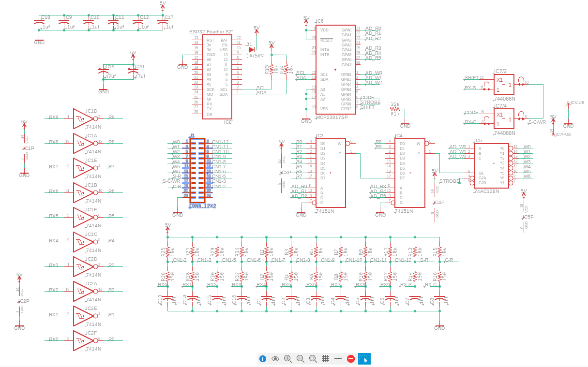

I am designed a printed circuit board for the Panasonic typewriter. At first I wanted to simplify the circuit because I thought that maybe much of the initial signal "cleaning" might not have been necessary. I was wrong. It turns out there is a lot of noise in the this typewriter's electronics. Below is an image of just one simple spike that was causing problems. 

Below is the schematic which is an exact copy of the presently working ciruit. I decided to connect the main circuit shown below to the typewriter via a 24-pin flat flex cable. The cable connector is shown as J1.

Below you can see the final PCB design.

And here is the board that connects directly to the typewriter circuit board via the 24-pin cable.

