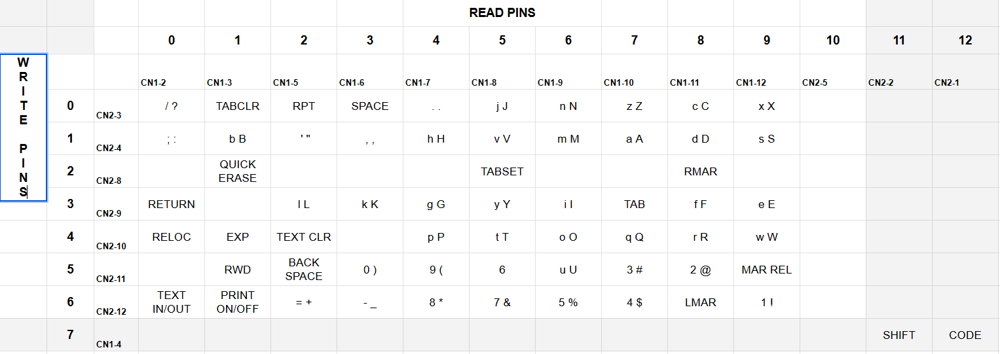

In this second half of my initial blog post, I will detail the software involved in controlling the texting typewriter. Please also check out my student's projects [here](https://mvthsengineering.com/).

## Step One: Sending an SMS message to a web application

To allow the system to receive texts, it needs to act like a phone. It needs a number and a way to access the messages. For this, I use a cloud based phone service, Twilio.

Twilio is a cloud-based service (with free account options) that can provide users with a phone number and on-line tools to manage the phone number such as applying webhooks. A webhook is a method for one application to automatically send real-time information to another application when a specific event occurs. In the case of the typewriter when the typewriter's Twilio number receives an SMS message it directs the contents of the message that message to the URL of the typewriter.

Below is a graphic from the Twilio website that represents an SMS message being directed by Twilio to an application. In the case of the typewriter, I am only dealing with inbound SMS messages and HTTP requests, but in the future it would be possible to respond to text messages.


## Step Two: Creating an local network URL for your application.

In order to give your application an accessible URL, you will need to set up a server on the ESP32. If you don't know how to do this, there are lots of guides on the internet, but the basic code for this application is shown below. In the case of this application, I am using an a async webserver.

```c
// Establish server
AsyncWebServer server(80);

 server.on("/sms", HTTP_GET, [](AsyncWebServerRequest *request) {
    enum SMS data;
    const AsyncWebParameter *p;

    data = BODY; // SMS message body
    p = request->getParam(data);
    body = p->value();
    Serial.println(body);

    data = FROM; // SMS sender phone number
    p = request->getParam(data);
    phone = p->value();
    Serial.println(phone);

    msg = true; // We have a message
  });

  // Start server
  server.begin();
```
At this point you have a local URL for your ESP32 that is available on your local network. Let's say your router assigns an address of 10.1.56.20 to your ESP32. In order to trigger the GET request shown in the code above, you could use the address 10.1.56.20:80/sms on your local network.

## Step Three: Creating an external URL for your application.

While it would be possible to create an externally accessible URL using a passthrough on a your internal router this is generally less secure and not possible if, as in my case, you are behind a firewall.

[ngrok](https://ngrok.com/) is a globally distributed reverse proxy which means that it can be used to easily provide an externally available URL for an applications inside your network. As with Twilio there is a free account level. Essentially, by running an ngrok service on your local network with a reference to your local device (the ESP32), ngrok will provide a unique and externally accessible URL to your local device. This URL can be entered into the web hook section of your Twilio account to allow Twilio to forward SMS messages directly to your ESP32.  

Here is where I confess to a little slight of hand when I said that I have replaced the both the Raspberry Pi and the Arduino in the previous version of hardware with just the ESP32. While it might be possible to run an ngrok service on an ESP32, that is not something I want to take on. In my case, I am running the ngrok service on a Raspberry Pi on my local network, This same service can also be used to create tunnels for all my local devices.

I won't go into the details of setting up a service because ngrok offers excellent tutorials for just about any application. I will provide an example of a generic YAML configuration file which is about all you need to customize and to get up and running. Note that you can include multiple tunnels, so any device on a single network can be addressed by a single ngrok service.

```
version: 3

agent:
  authtoken: 4nq9771bPxe8ctg7LKr_2ClH7Y15Zqe4bWLWF9p

tunnels:
  basic:
    proto: http
    addr: 10.1.56.20:80
```

## Step four: Send the SMS message to your typewriter

The following is the function used to send characters to the typewriter circuit. Specifically, this function sends an address via I2C to the MCP27013 which in turn controls the typewriter circuit. The function first checks to see if the character requires a shift key and if it is a capital letter. It then retrieves the correct write and read pins from the letters array. The address is manipulated as described below to accommodate for the two multiplexers and one demultiplexer. The function determines if the SHIFT key or the CODE key are required. The demultiplexer is strobed to send the address to the typewriter circuit.

```c
void send_character(uint8_t c) {
  static char last_character;
  bool shift = false;


  // Check to see which sort of character is being sent.
  char *odds = strchr(odds_char, c);
  char *keys = strchr(keys_char, c);
  char *caps = strchr(caps_char, c);
  char *ctrs = strchr(ctrs_char, c);

  if (caps != NULL) {
    shift = true;
    c += 32;
  } else if (odds != NULL) {
    shift = true;
  } else {
    shift = false;
  }

  // Each character corresponds to two bytes in letter array that write and read pins respectively
  uint8_t tx_pin_select = letters[c][0];
  uint8_t rx_pin_select = letters[c][1];

  /*  There are two 8-channel mulitpexers to accomodate 12 bits. This requires 6 address bits. Three for the lower MP and
      3 for the upper MP. The output of the lower MP is connected to channel 7 (a free channel) on the upper MP. To address the 
      lower MP you must select that address for the lower byte and 7 for the upper byte to access channel 7. To address the upper MP 
      you need to subtract 8 and shift the bits by 4.
  */
  if (rx_pin_select > 7) {
    rx_pin_select -= 8;
    rx_pin_select <<= 4;
  } else {
    rx_pin_select |= 0x70;
  }

  // Select channel on demultiplexer from which to write signal
  mcp.writeGPIOA(rx_pin_select);

  // Select channel on multiplexer from which to read signal and disable strobe with OR.
  mcp.writeGPIOB(tx_pin_select | 0x40);

  // Turn on SHIFT (set off, LOW, by default with write to GPIOB) give time to settle
  if (shift == true) mcp.digitalWrite(SHIFT, HIGH);
  if (shift == true) delay(200);

  // Turn on CODE (set off, LOW, by default with write to GPIOB) give time to settle
  if (code == true) mcp.digitalWrite(CODE, HIGH);
  if (code == true) delay(200);

  // Delay to allow for double characters. The typewriter by default rejects double characters when printed too quickly
  if (last_character == c) delay(50);

  // Strobe demulitplexer to type character
  mcp.digitalWrite(STROBE, LOW);
  delay(100);
  mcp.digitalWrite(STROBE, HIGH);
  last_character = c;

  // Turn off SHIFT
  mcp.digitalWrite(SHIFT, LOW);

  // Turn off CODE
  mcp.digitalWrite(CODE, LOW);
}
```

Below is an excerpt from 128 character letters array show ASCII values on the corresponding write and read pins. The write pin addresses are on the left and read pin address are on the right. The SMS seems to be encoded in ASCII but according to Twilio they use GSM7. I am in the process of clarifying this and will update the blog when I find out.

```
  { 1, 3 },  //44 ,
  { 6, 3 },  //45 -
  { 0, 4 },  //46 .
  { 0, 0 },  //47 /
  { 5, 3 },  //48 0
  { 6, 9 },  //49 1

  { 5, 8 },  //50 2
  { 5, 7 },  //51 3
  { 6, 7 },  //52 4
  { 6, 6 },  //53 5
  { 5, 5 },  //54 6
```

The following table shows how the read and write pins correspond to every key on the typewriters keyboard.



## Step five:  Checking the phone directory

In my code this step obviously comes before step four, but since it is not a necessary part of simply printing a retrieved SMS message, I adding it here more as an optional step. I am using LittleFS a lightweight file system for reading from and writing to files on the ESP32. Since there is a lot of good tutorials on how to do this, I won't go into all the general details.

Specific to this code is the following function which determine if a phone number is in the phones.txt file and, if so, return a corresponding name.

```c
// Determines if a callers number is in the phnoe file and returns a name, UNKNOWN or not found
String findCaller(fs::FS &fs, String n) {
  String name;
  File file = fs.open(pathToFile, "r");

  if (!file) {
    Serial.println("No Saved Data!");
  }

  // Read through the file line by line. If callers number is found, return the corresponding name.
  while (file.available()) {
    String line = file.readStringUntil('\n');
    if (line.indexOf(n) != -1) {
      name = line.substring(line.indexOf(',') + 1);
      name.trim();
    }
  }
  file.close();
  return name;
}
```

An example of what the phones file looks like is shown below.

```
+16156059862, James
+16978484216, John
+16079219030, Martin
+17015307401, Peter
+11390427199, Suzi
```
Please check out the [github](https://github.com/medfordengineering/TypewriterESP32/tree/main) for this project for more information.
