About a decade ago, I made about a dozen or so paper craft cards. Mostly these were birthday cards for my family but a few were holiday cards. I made them out of sturdy 110lb paper. I also added modgepodge and a polyurethane sealer after they were finished. The result was fairly study but as you can see (images below) still suffered damage. My plan is to rework each one and use a much stronger sealent to preserve them. My first test will be with [Powertex's transparent textile hardener.](https://powertexproductsusa.com/products/powertex-universal-medium-transparent-1000gr?pr_prod_strat=e5_desc&pr_rec_id=1a4815e0c&pr_rec_pid=1447160873029&pr_ref_pid=1447100776517&pr_seq=uniform) If this does not work, I have heard the Minwax wood hardner is a good option.

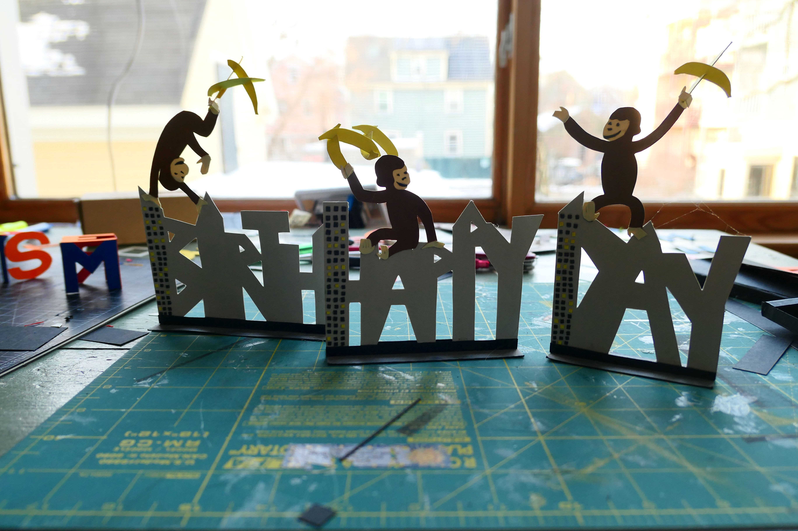 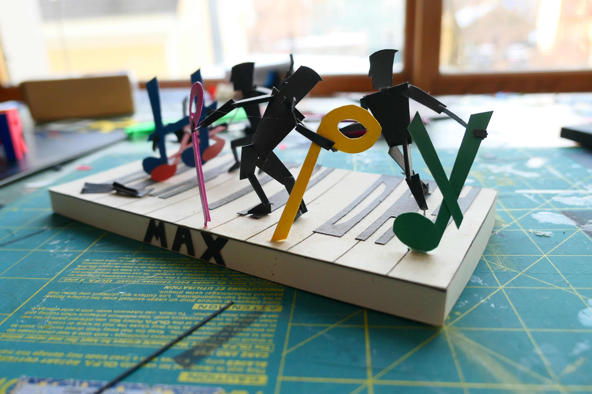 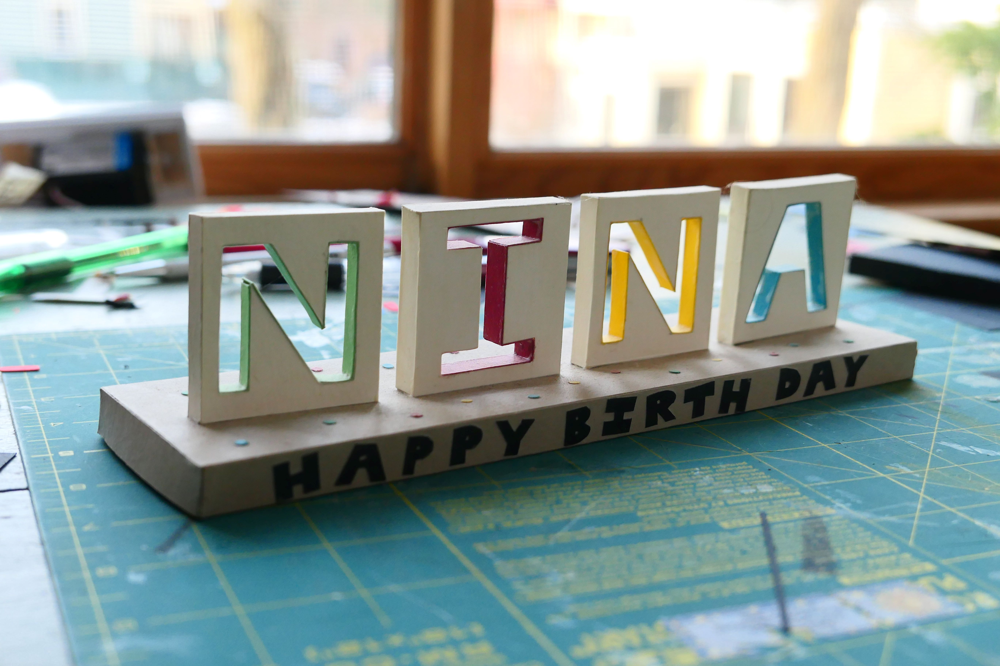 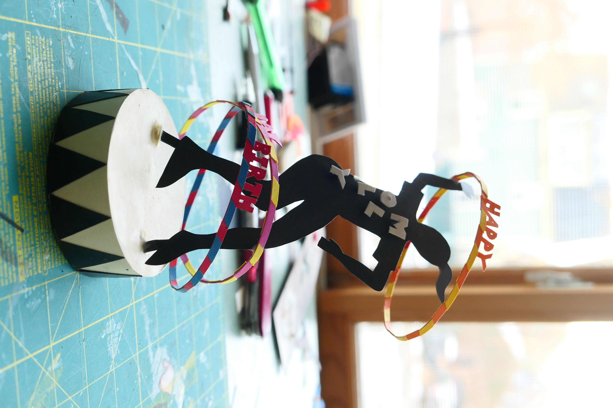 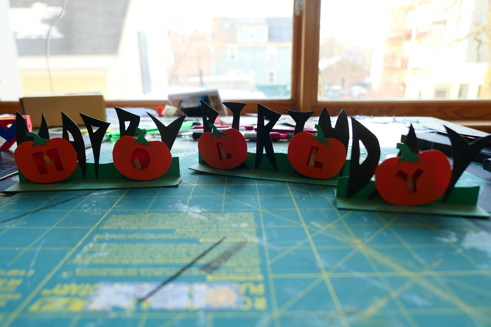

My first project is to repair a Christmas paper craft card (see below) that is in such bad shape that it needs to be rebuilt completely.

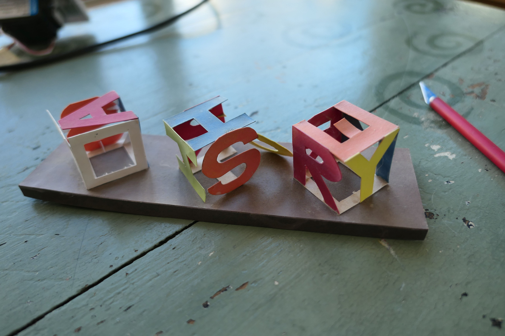

## Step One

The first step is getting all my old tools together. Almost all of the work is done with pencil and the standard Xacto knife you see below. All of the design, drawing and cutting with very few exceptions is done freehand. I will use a straight edge to create parallel lines if I need letters to be similar height and I will cut with a straight edge for longer flat cuts such as stages. The eraser is useful for removing drawing lines. This this first time I have used a razor blade and it came in handy when I was fixing some mistakes. 

The pocket knife is used for its small pair of scissors. The tweezers are useful for placing parts. I have a better pair, but I can't find them. The pen is used only for its rounded outside top and for the purpose of smoothing the edge of paper after it has been cut.

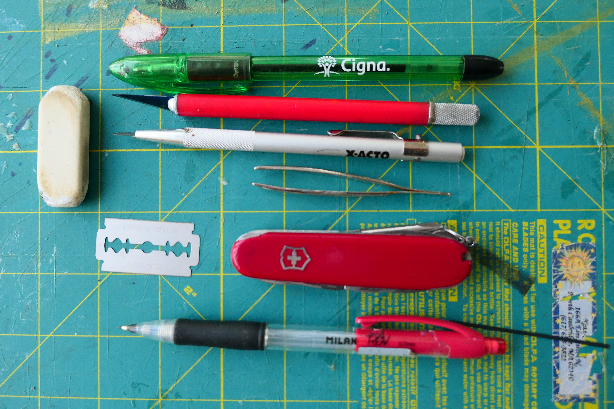

In addition, I have a good supply of Canford 110lb paper which I used to be able to buy locally, but unfortunately, now must purchase on line.

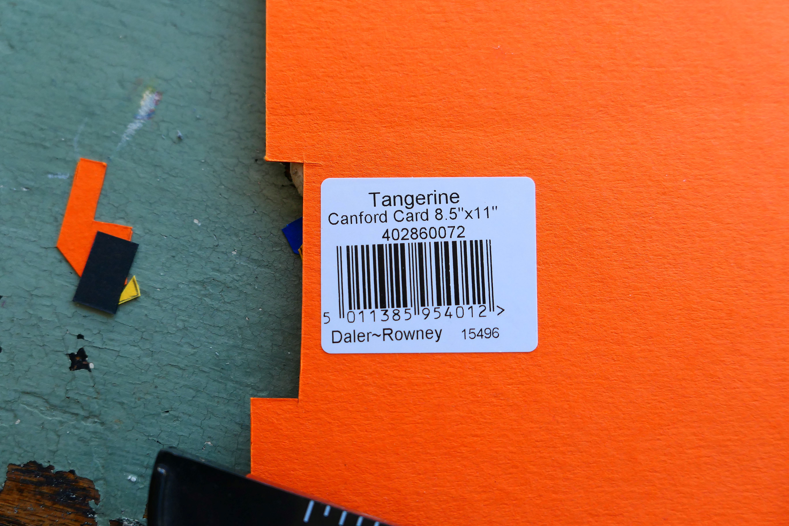

## Step Two

The next step is to trace the outlines of all of the parts of the original design. Again, the initial versions were all done freehand so I am just coping the freehand versions. Even straigh lines are done freehand. This gives all of the letters a consistent look.

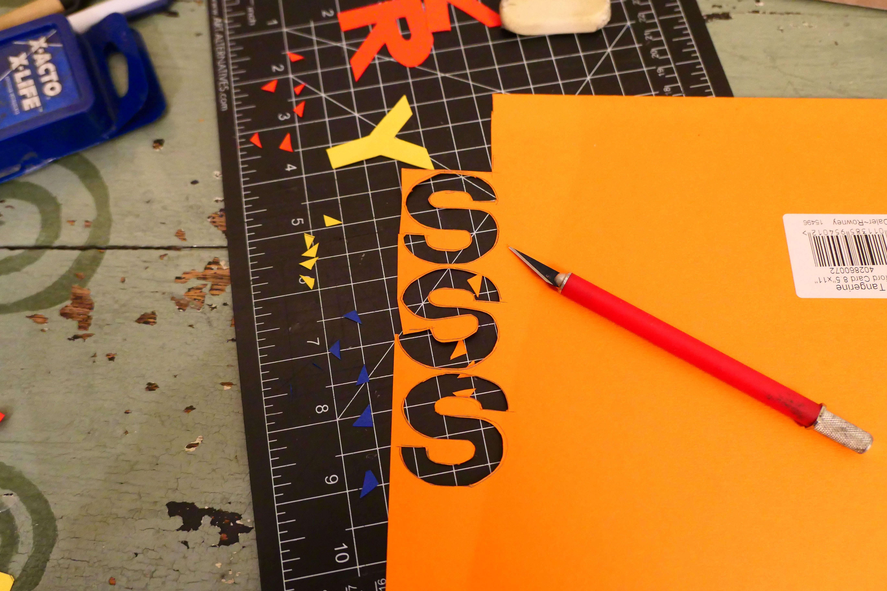

## Step Three

Once all the letters are cut, I cut a lot of triangle braces in different colors which will be used to support the letters. Then I glue the mounts to the letters and begin to create the boxes of letters.

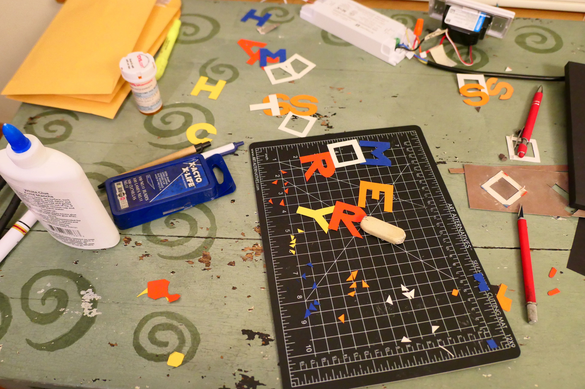

Here are the letters with mounts.

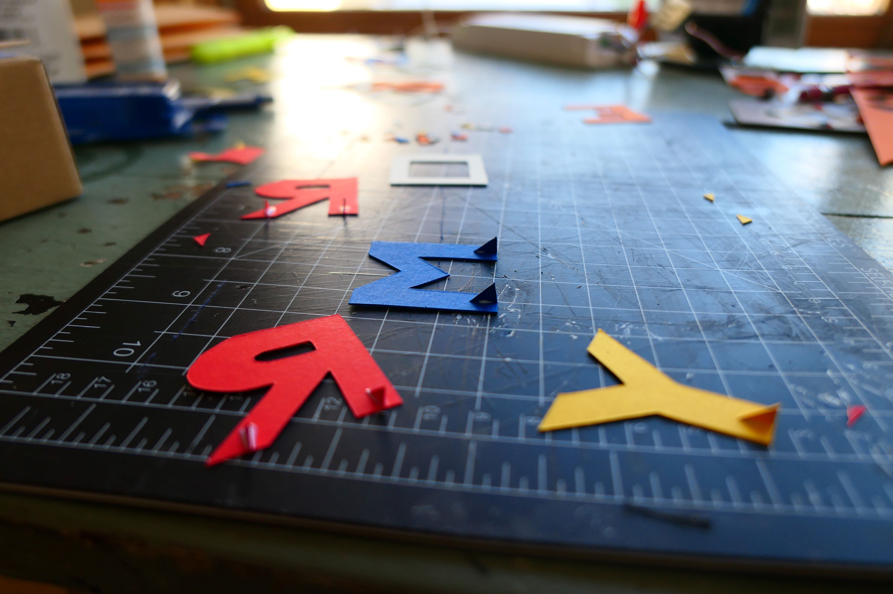

And here is the first box of letters.

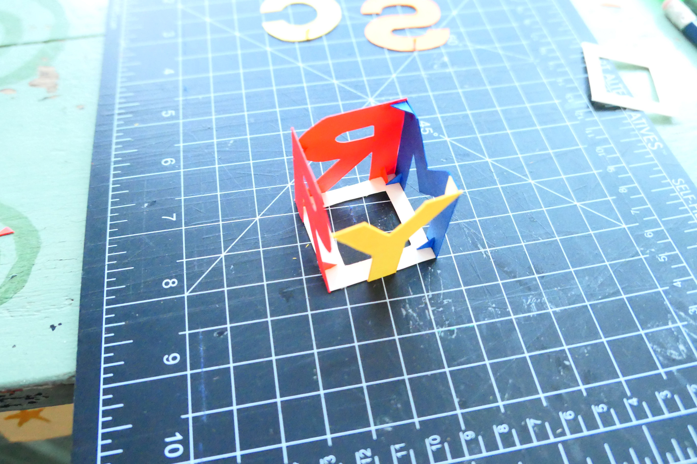

# Step Four

Step four is change the plan. I woke up the next morning and decided that I did not want to have the white bases on the boxes. At first I thought I would use black to match the base, but then decided to remove them all together. Here is where the razor blade came in handy. It would have been impossible to surgically remove the base with a standard Xacto knife.

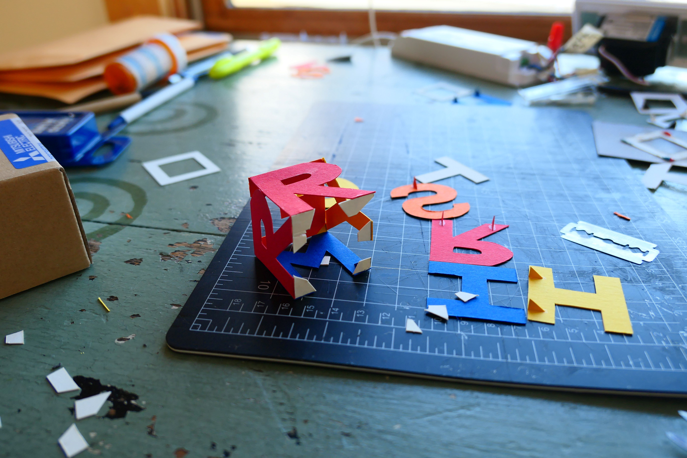

Below you can see two views of the boxes almost complete and without bases. 

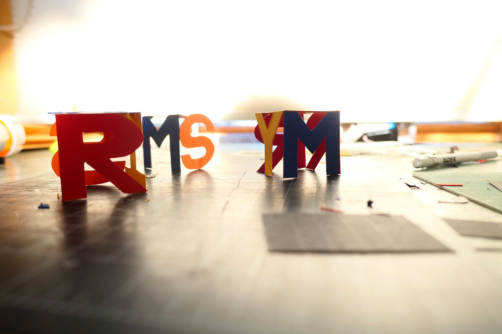 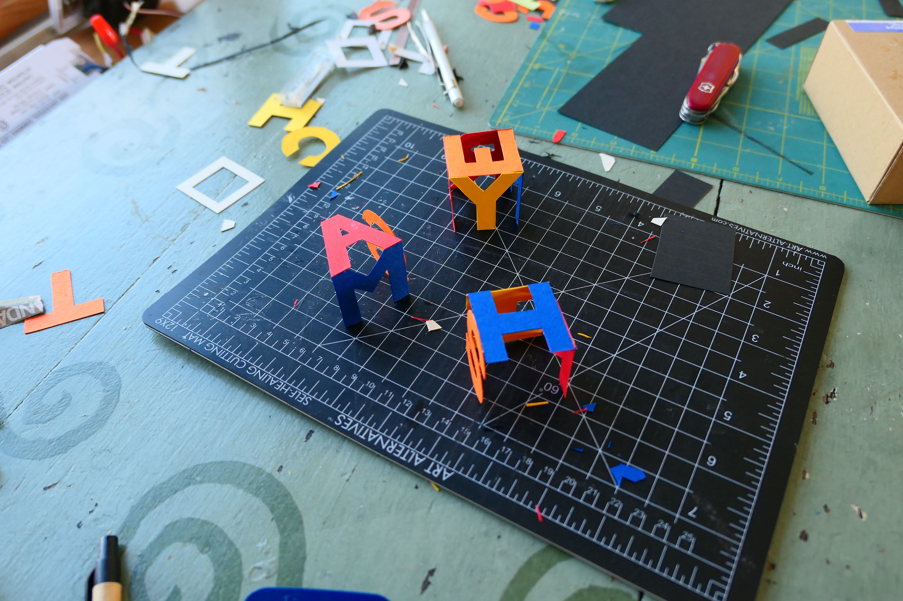
