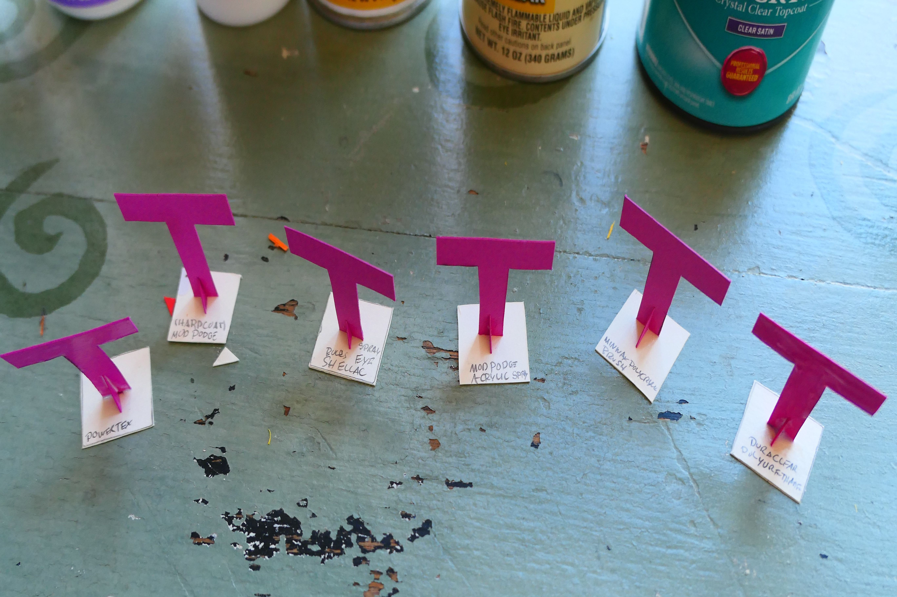

In this post I am going to test the five sealers in order to determine which provides the most durable finish and secondly which is the easiest to apply. The line up includes, Powertex Universal Medium, Mod Poge Hard Coat, Dura Clear Polyurethane, Mod Podge Clear Acrylic Sealer, Bulls Eye Shellac, and Minwax Polycrylic. I will initially test three coats of each on the five Ts which are made from 110lb card stock.

